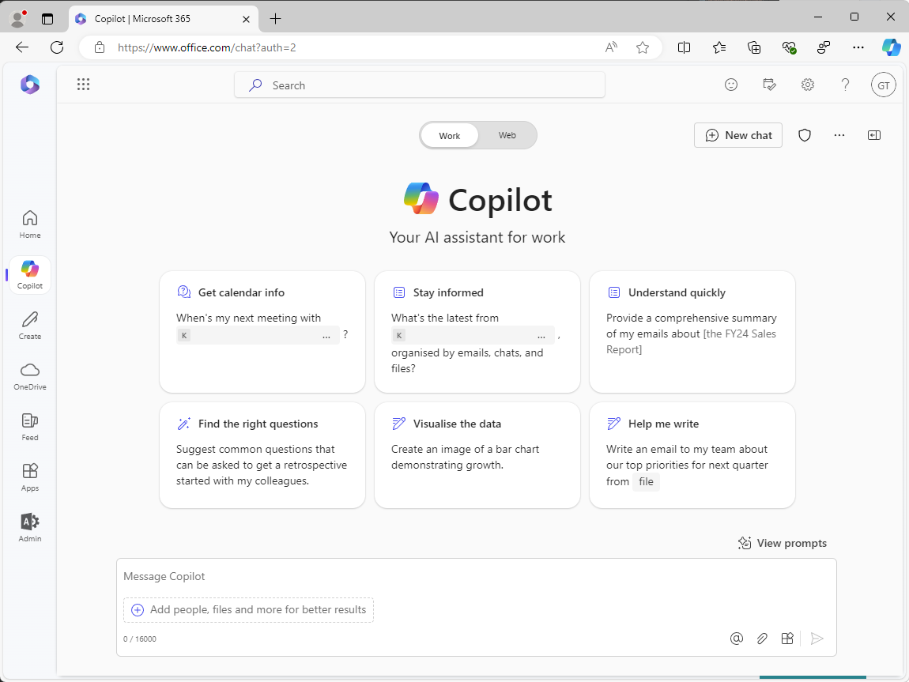
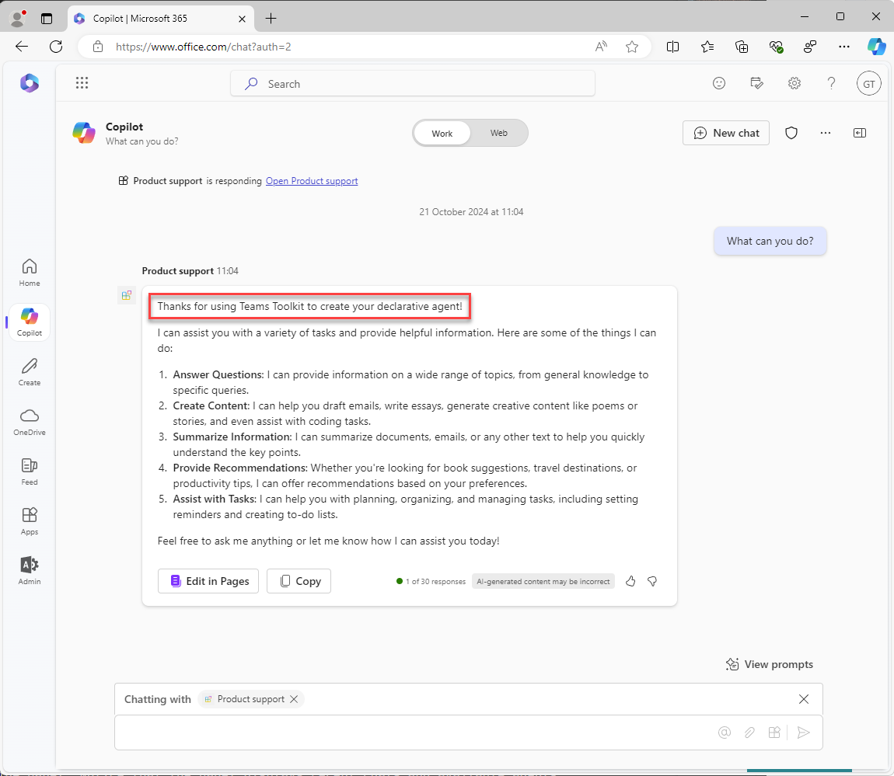
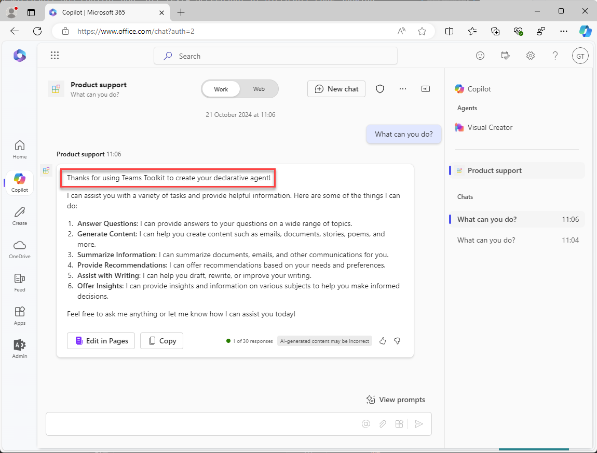

---
lab:
  title: 演習 1 - Visual Studio Code で宣言型エージェントを作成する
  module: 'LAB 01: Build a declarative agent for Microsoft 365 Copilot using Visual Studio Code'
---

# 演習 1 - 宣言型エージェントを作成する

この演習では、テンプレートから宣言型エージェント プロジェクトを作成し、マニフェストを更新し、エージェントを Microsoft 365 にアップロードして、Microsoft 365 Copilot でエージェントをテストします。 

宣言型エージェントは、Microsoft 365 アプリに実装されます。 次を含むアプリ パッケージを作成します。

- app.manifest.json: アプリ マニフェスト ファイルには、アプリの構成方法 (機能など) が記述されています。
- declarative-agent.json: 宣言型エージェント マニフェストには、宣言型エージェントの構成方法が記述されています。
- color.png と outline.png: Microsoft 365 Copilot ユーザー インターフェイスで宣言型エージェントを表すために使用される色とアウトラインのアイコン。

### 演習の期間

- **推定所要時間**: 15 分

## タスク 1 - スターター プロジェクトをダウンロードする

まず、Web ブラウザーで GitHub からサンプル プロジェクトをダウンロードします。

1. [https://github.com/microsoft/learn-declarative-agent-vscode](https://github.com/microsoft/learn-declarative-agent-vscode) テンプレート リポジトリに移動します。
    1. 手順に従って、コンピューターに[リポジトリのソース コードをダウンロード](https://docs.github.com/repositories/working-with-files/using-files/downloading-source-code-archives#downloading-source-code-archives-from-the-repository-view)します。
    1. ダウンロードした ZIP ファイルの内容をコンピューター上の **Documents フォルダー**に展開します。

スターター プロジェクトには、宣言型エージェントを含む Teams Toolkit プロジェクトが含まれています。

1. Visual Studio Code で  プロジェクト フォルダーを開きます。
1. プロジェクトのルート フォルダーで、**README.md** ファイルを開きます。 プロジェクト構造の詳細については、内容を確認します。


## タスク 2 - 宣言型エージェント マニフェストを調べる

宣言型エージェント マニフェスト ファイルを調べてみましょう。

- **appPackage/declarativeAgent.json** ファイルを開き、内容を確認します。

    ```json
    {
        "$schema": "https://aka.ms/json-schemas/agent/declarative-agent/v1.0/schema.json",
        "version": "v1.0",
        "name": "da-product-support",
        "description": "Declarative agent created with Teams Toolkit",
        "instructions": "$[file('instruction.txt')]"
    }
    ```

**instructions** プロパティの値には、**instruction.txt** という名前のファイルへの参照が含まれています。 **$[file(path)]** 関数は Teams Toolkit によって提供されます。 **instruction.txt** の内容は、Microsoft 365 にプロビジョニングされるときに宣言型エージェント マニフェスト ファイルに含まれます。

- **appPackage** フォルダーで、**instruction.txt** ファイルを開き、内容を確認します。

    ```md
    You are a declarative agent and were created with Team Toolkit. You should start every response and answer to the user with "Thanks for using Teams Toolkit to create your declarative agent!\n\n" and then answer the questions and help the user.
    ```

## タスク 3 - 宣言型エージェント マニフェストを更新する

**name** プロパティと **description** プロパティを、このシナリオに関連するように更新しましょう。

1. **appPackage** フォルダーで、**declarativeAgent.json** ファイルを開きます。
1. **name** プロパティ値を **Product support** に更新します。
1. **description** プロパティ値を **Product support agent に更新します。これは、Contoso Electronics 製品に関する顧客のクエリに回答するのに役立ちます**。
1. 変更を保存します

更新されたファイルの内容は次のとおりです。

```json
{
    "$schema": "https://aka.ms/json-schemas/agent/declarative-agent/v1.0/schema.json",
    "version": "v1.0",
    "name": "Product support",
    "description": "Product support agent that can help answer customer queries about Contoso Electronics products",
    "instructions": "$[file('instruction.txt')]"
}
```

## タスク 4 - 宣言型エージェントを Microsoft 365 にアップロードする

> [!IMPORTANT]
> 開始する前に、Visual Studio Code に Teams Toolkit 拡張機能がインストールされていることを確認します。 マーケットプレースから拡張機能をまだインストールしていない場合は、今すぐインストールします。

次に、宣言型エージェントを Microsoft 365 テナントにアップロードします。

Visual Studio Code:

1. **Activity Bar** で、**Teams Toolkit** 拡張機能を開きます。

    

1. **[Lifecycle]** セクションで、**[Provision]** を選択します。

    ![Teams Toolkit ビューを示す Visual Studio Code の のスクリーンショット。 [Lifecycle] セクションで 'Provision' 関数が強調表示されています。](../media/LAB_01/provision.png)

1. プロンプトで、**[Sign in]** を選択し、プロンプトに従って Teams Toolkit を使用して Microsoft 365 テナントにサインインします。 プロビジョニング プロセスは、サインイン後に自動的に開始されます。

    ![ユーザーに Microsoft 365 へのサインインを求める Visual Studio Code からのプロンプトのスクリーンショット。 [Sign in] ボタンが強調表示されています。](../media/LAB_01/provision-sign-in.png)

    

1. アップロードが完了するまで待ってから次に進みます。

    

次に、プロビジョニング プロセスの出力を確認します。

- **appPackage/build** フォルダーで、**declarativeAgent.dev.json** ファイルを開きます。

**instructions** プロパティの値に、**instruction.txt** ファイルの内容が含まれていることに注目してください。 **declarativeAgent.dev.json** ファイルは、**manifest.dev.json**、**color.png**、**outline.png** の各ファイルと共に、**appPackage.dev.zip** ファイルに含まれています。 **appPackage.dev.zip** ファイルは Microsoft 365 にアップロードされます。

## タスク 5 - Microsoft 365 Copilot で宣言型エージェントをテストする

次に、Microsoft 365 Copilot で宣言型エージェントを実行し、**コンテキスト内**と**イマーシブ**の両方のエクスペリエンスでその機能を検証してみましょう。

Visual Studio Code:

1. **Activity Bar**で、**[Run and Debug]** ビューに切り替えます。

    ![Visual Studio Code のスクリーンショット。 Activity Bar の [Run and Debug] アイコンが強調表示されています。](../media/LAB_01/debug-open.png)

1. 構成のドロップダウンの横にある **[Start Debugging]** ボタンを選択するか、<kbd>F5</kbd> キーを押します。 新しいブラウザー ウィンドウが起動し、Microsoft 365 Copilot に移動します。

    ![[Run and Debug] ビューを示す Visual Studio Code のスクリーンショット。 [Start Debugging] アイコンが強調表示されています。](../media/LAB_01/debug-start.png)

    

    

ブラウザーで続けて、**コンテキスト内**エクスペリエンスをテストしてみましょう。

1. **Microsoft 365 Copilot** で、メッセージ ボックスに <kbd>@</kbd> 記号を入力します。 使用可能なエージェントの一覧を示すポップアップが表示されます。

    

1. ポップアップで **Product support** を選択します。 メッセージ ボックスの上にあるステータス メッセージに注目してください。 **Chatting with Product support** が表示されます。これは、エージェントのコンテキスト内エクスペリエンスを使用していることを示します。

    

1. テキスト ボックスに「**What can you do?**」と入力し、メッセージを送信します。

    

1. 応答を待ちます。 応答がテキスト "Thanks for using Teams Toolkit to create your declarative agent!" で始まることに注目してください。 前に確認した手順で定義されているとおりです。

    

1. コンテキスト内エクスペリエンスを終了するには、ステータス メッセージでバツ (X) を選択します。 ステータス メッセージが削除され、エージェントとのチャットが終了したことを示すメッセージがチャット ウィンドウに表示されます。

    

    

最後に、**イマーシブ** エクスペリエンスをテストしてみましょう。

Web ブラウザーでの続行:

1. **Microsoft 365 Copilot** で、右上にあるアイコンを選択して、Copilot サイド パネルを展開します。 パネルに最近のチャットと利用可能なエージェントが表示されることに注目してください。

    

1. サイド パネルで、**Product support** を選択してイマーシブ エクスペリエンスを入力し、エージェントと直接チャットします。 インターフェイスに 2 つのサンプル プロンプトが表示されていることに注目してください。

    

1. **Learn more** というタイトルのサンプル プロンプトを選択します。 テキスト ボックスにテキスト **What can you do?** が追加されたことに注目してください。

    

1. メッセージを送信し、応答を待ちます。 応答がテキスト "Thanks for using Teams Toolkit to create your declarative agent!" で始まることに注目してください。 前に確認した手順で定義されているとおりです。

    

最後に、ブラウザーを閉じて、Visual Studio Code でデバッグ セッションを停止します。