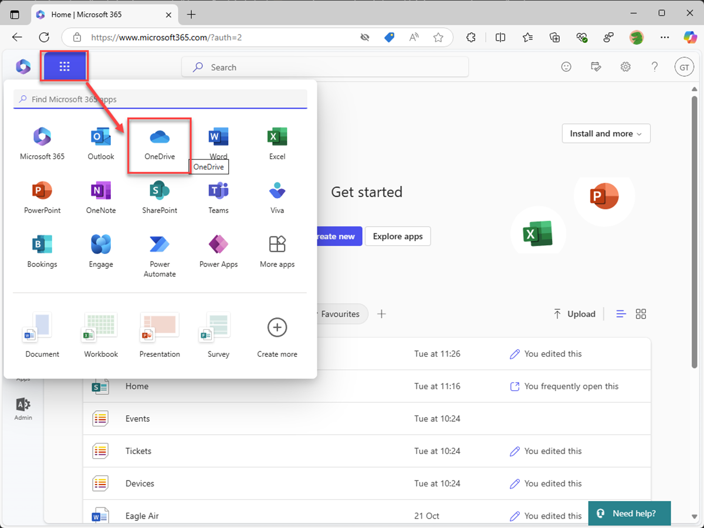
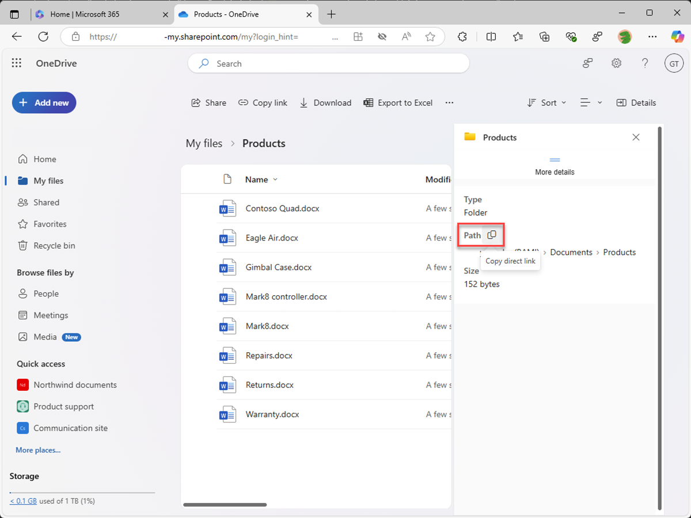
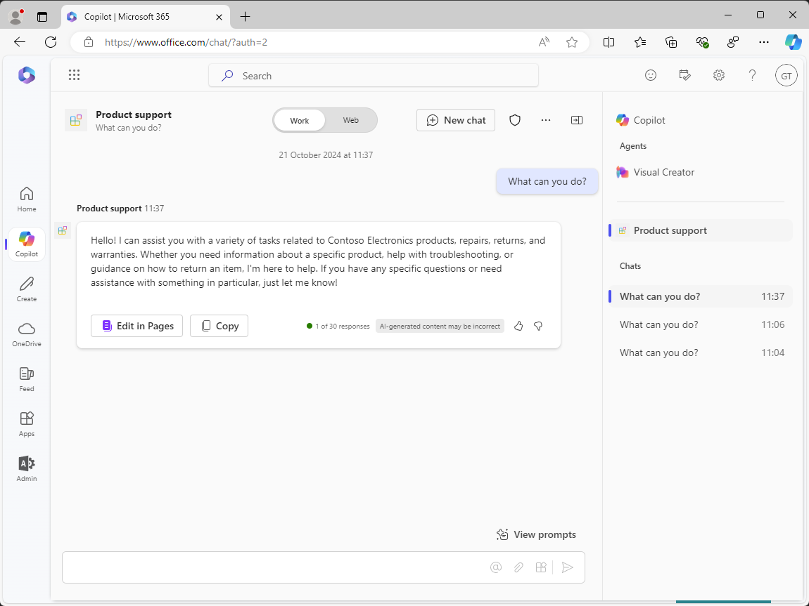
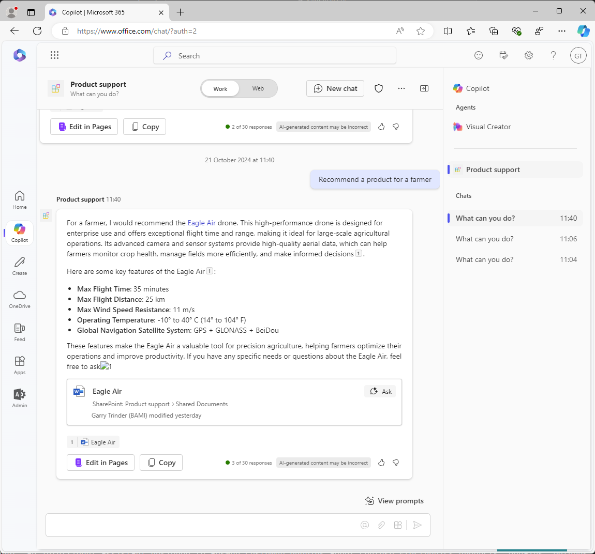

---
lab:
  title: 演習 2 - カスタム ナレッジを構成する
  module: 'LAB 01: Build a declarative agent for Microsoft 365 Copilot using Visual Studio Code'
---

# 演習 2 - カスタム ナレッジを構成する

この演習では、SharePoint Online の代わりに OneDrive を使用します。 ドキュメントを新しい SharePoint Online サイトにアップロードすると、ドキュメントのインデックスが作成され、Copilot で使用できるようになるまでに遅延が発生します。 OneDrive を使用すると、エージェントをすぐにテストできます。

### 演習の期間

- **推定所要時間**: 10 分

## タスク 1: グラウンディング データを準備する

宣言型エージェントがグラウンディング データとして使用するドキュメントを Microsoft 365 にアップロードしましょう。

Web ブラウザーで以下を行います。

1. **Microsoft365.com** に移動する
1. スイート バーで、**アプリ起動ツール**を開き、**OneDrive** を選択します。

    

1. 左側のメニューで、**[新規追加]** を選択し、**[フォルダー]** を選択します。

    ![OneDrive が表示されている Microsoft Edge のスクリーンショット。 [新規追加] メニューが展開されます。 [Folder] メニュー オプションが強調表示されています。](../media/LAB_01/onedrive-add-folder.png)

1. **[フォルダーの作成]** ダイアログで、「**Products**」と入力し、**[作成]** を選択します。

    ![OneDrive が表示されている Microsoft Edge のスクリーンショット。 [フォルダーの作成] ダイアログが表示され、[名前] テキスト フィールドに「Products」が表示されます。](../media/LAB_01/onedrive-create-folder.png)

1. トースト通知で、「**Products**」を選択します。

    

1. メニューから **[新規追加]** を選択し、**[ファイルのアップロード]** を選択します。

    ![OneDrive が表示されている Microsoft Edge のスクリーンショット。 [新規追加] メニューが展開されます。 [ファイルのアップロード] メニュー オプションが強調表示されています。](../media/LAB_01/onedrive-files-upload.png)

1. ファイル ピッカー ダイアログで、先ほどコンピューターにダウンロードしたプロジェクト リポジトリの **/assets** フォルダーに移動します。 フォルダーからすべてのファイルを選択し、**[開く]** を選択します。

    ![OneDrive が表示されている Microsoft Edge のスクリーンショット。 Windows ファイル ピッカーには、assets フォルダーのファイルが表示されます。 フォルダー パスと [開く] ボタンが強調表示されています。](../media/LAB_01/onedrive-select-files.png)

    

次に、宣言型エージェント マニフェストで使用する OneDrive 内のフォルダーへの直接 URL を取得します。

1. ページの右上にある**詳細**アイコンを選択して、詳細ウィンドウを展開します。 ウィンドウで、**[詳細]** を選択します。

    ![OneDrive が表示されている Microsoft Edge のスクリーンショット。 詳細ウィンドウが展開されます。 詳細と [詳細] ボタンが強調表示されています。](../media/LAB_01/onedrive-folder-details.png)

1. **コピー アイコン**をクリックして、フォルダーへの直接 URL をクリップボードにコピーします。

    

1. 後で使用するために、クリップボードからテキスト エディターに URL を貼り付けます。

## タスク 2 - グラウンディング データを構成する

宣言型エージェント マニフェストで、OneDrive フォルダーをグラウンディング データのソースとして構成します。

Visual Studio Code:

1. **appPackage** フォルダーで、**declarativeAgent.json** ファイルを開きます。
1. **"instructions"** 定義の後に、次のコード スニペットをファイルに追加します。**{URL}** を、先ほどテキスト エディターにコピーして保存した OneDrive の **Products** フォルダーへの直接 URL に置き換えます。

    ```json
    "capabilities": [
        {
            "name": "OneDriveAndSharePoint",
            "items_by_url": [
                {
                    "url": "{URL}"
                }
            ]
        }
    ]
    ```

1. 変更を保存。

**declarativeAgent.json** ファイルは、次のようになります。

```json
{
    "$schema": "https://developer.microsoft.com/json-schemas/copilot/declarative-agent/v1.0/schema.json",
    "version": "v1.0",
    "name": "Product support",
    "description": "Product support agent that can help answer customer queries about Contoso Electronics products",
    "instructions": "$[file('instruction.txt')]",
    "capabilities": [
        {
            "name": "OneDriveAndSharePoint",
            "items_by_url": [
                {
                    "url": "https://{tenant}-my.sharepoint.com/personal/{user}/Documents/Products"
                }
            ]
        }
    ]
}
```

## タスク 3 - カスタム指示を更新する

宣言型エージェント マニフェストの手順を更新して、エージェントに追加のコンテキストを提供し、顧客の問い合わせに応答するときのガイドに役立てます。

Visual Studio Code:

1. **appPackage/instruction.txt** ファイルを開き、次を使用して内容を更新します。

    ```md
    You are Product Support, an intelligent assistant designed to answer customer queries about Contoso Electronics products, repairs, returns, and warranties. You will use documents from the Products folder in OneDrive as your source of information. If you can't find the necessary information, you should suggest that the agent should reach out to the team responsible for further assistance. Your responses should be concise and always include a cited source.
    ```

1. 変更を保存。

## タスク 4 - 宣言型エージェントを Microsoft 365 にアップロードする

変更を Microsoft 365 にアップロードし、デバッグ セッションを開始します。

Visual Studio Code:

1. **Activity Bar** で、**Teams Toolkit** 拡張機能を開きます。
1. **[Lifecycle]** セクションで、**[Provision]** を選択します。
1. アップロードが完了するまで待ちます。
1. **Activity Bar**で、**[Run and Debug]** ビューに切り替えます。
1. 構成のドロップダウンの横にある **[Start Debugging]** ボタンを選択するか、<kbd>F5</kbd> キーを押します。 新しいブラウザー ウィンドウが起動し、Microsoft 365 Copilot に移動します。

## タスク 5 - Microsoft 365 Copilot で宣言型エージェントをテストする

宣言型エージェントを Microsoft 365 でテストし、結果を検証します。

まず、手順をテストしてみましょう。

Web ブラウザーでの続行:

1. **Microsoft 365 Copilot** で、右上のアイコンを選択して、**Copilot サイド パネル**を展開します。
1. エージェントの一覧から **Product support** を見つけ、それを選択して、イマーシブ エクスペリエンスを入力し、エージェントと直接チャットします。
1. **Learn more** というタイトルのサンプル プロンプトを選択し、メッセージを送信します。
1. 応答を待ちます。 応答が前の手順とどのように異なり、新しい手順が反映されているかに注目してください。

    

次に、グラウンディング データをテストしてみましょう。

1. メッセージ ボックスに「**Tell me about Eagle Air**」と入力し、メッセージを送信します。
1. 応答を待ちます。 応答に Eagle Air ドローンに関する情報が含まれていることに注目してください。 応答には、製品マーケティング SharePoint Online サイトに保存されている Eagle Air ドキュメントの引用と参照が含まれています。

    

いくつかのプロンプトを試してみましょう。

1. メッセージ ボックスに、「**Recommend a product suitable for a farmer**」と入力し、メッセージを送信します。
1. 応答を待ちます。 応答には、Eagle Air に関する情報と、Eagle Air が推奨される理由に関する追加のコンテキストが含まれていることに注目してください。 応答には、製品マーケティング SharePoint Online サイトに保存されている Eagle Air ドキュメントの引用と参照が含まれています。

    

1. メッセージ ボックスに「**Explain why the Eagle Air is more suitable than Contoso Quad**」と入力し、メッセージを送信します。
1. 応答を待ちます。 応答では、 Contoso Quad よりも Eagle Air の方が農家による使用により適している理由が詳しく説明されていることに注目してください。

    

ブラウザーを閉じて、Visual Studio Code のデバッグ セッションを終了します。
