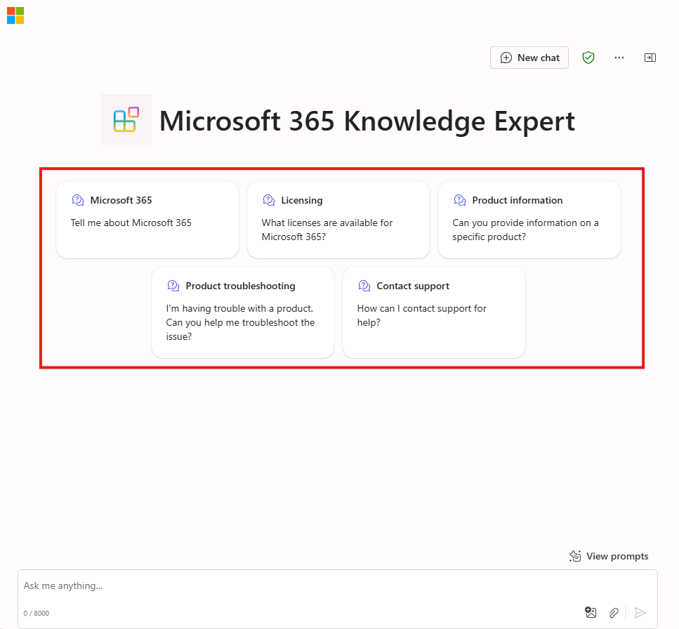

---
lab:
  title: 演習 3 - 宣言型エージェントに会話スターターを追加する
  module: 'LAB 01: Build a declarative agent for Microsoft 365 Copilot using Visual Studio Code'
---

# 演習 3 - 宣言型エージェントに会話スターターを追加する

この演習では、ユーザーが質問できる質問の種類を理解するのに役立つサンプル プロンプトをユーザーに提供する会話スターターを含むように宣言型エージェントを更新します。

### 演習の期間

- **推定所要時間**: 5 分

## タスク 1 - 会話スターターを追加する

Visual Studio Code:

1. **appPackage** フォルダーで、**declarativeAgent.json** ファイルを開きます。
1. 次のコード スニペットをファイルに追加します。

   ```json
   "conversation_starters": [
       {
           "title": "Product information",
           "text": "Tell me about Eagle Air"
       },
       {
           "title": "Returns policy",
           "text": "What is the returns policy?"
       },
       {
           "title": "Product information",
           "text": "Can you provide information on a specific product?"
       },
       {
           "title": "Product troubleshooting",
           "text": "I'm having trouble with a product. Can you help me troubleshoot the issue?"
       },
       {
           "title": "Repair information",
           "text": "Can you provide information on how to get a product repaired?"
       },
       {
           "title": "Contact support",
           "text": "How can I contact support for help?"
       }
   ]
   ```

1. 変更を保存。

**declarativeAgent.json** ファイルは、次のようになります。

```json
{
  "$schema": "https://developer.microsoft.com/json-schemas/copilot/declarative-agent/v1.0/schema.json",
  "version": "v1.0",
  "name": "Product support",
  "description": "Product support agent that can help answer customer queries about Contoso Electronics products",
  "instructions": "$[file('instruction.txt')]",
  "capabilities": [
    {
      "name": "OneDriveAndSharePoint",
      "items_by_url": [
        {
          "url": "https://{tenant}-my.sharepoint.com/personal/{user}/Documents/Products"
        }
      ]
    }
  ],
  "conversation_starters": [
    {
      "title": "Product information",
      "text": "Tell me about Eagle Air"
    },
    {
      "title": "Returns policy",
      "text": "What is the returns policy?"
    },
    {
      "title": "Product information",
      "text": "Can you provide information on a specific product?"
    },
    {
      "title": "Product troubleshooting",
      "text": "I'm having trouble with a product. Can you help me troubleshoot the issue?"
    },
    {
      "title": "Repair information",
      "text": "Can you provide information on how to get a product repaired?"
    },
    {
      "title": "Contact support",
      "text": "How can I contact support for help?"
    }
  ]
}
```

## タスク 2 - Microsoft 365 Copilot で宣言型エージェントをテストする

次に、変更をアップロードし、デバッグ セッションを開始します。

Visual Studio Code:

1. **Activity Bar** で、**Teams Toolkit** 拡張機能を開きます。
1. **[Lifecycle]** セクションで、**[Provision]** を選択します。
1. アップロードが完了するまで待ちます。
1. **Activity Bar**で、**[Run and Debug]** ビューに切り替えます。
1. 構成のドロップダウンの横にある **[Start Debugging]** ボタンを選択するか、<kbd>F5</kbd> キーを押します。 新しいブラウザー ウィンドウが起動し、Microsoft 365 Copilot に移動します。

次に、宣言型エージェントを Microsoft 365 でテストし、結果を検証します。

Web ブラウザーでの続行:

1. **Microsoft 365 Copilot** で、右上にあるアイコンを選択して、**Copilot サイド パネル**を展開します。
1. エージェントの一覧から **Product support** を見つけ、それを選択して、イマーシブ エクスペリエンスを入力し、エージェントと直接チャットします。 マニフェストで定義した会話スターターがユーザー インターフェイスに表示されることに注目してください。



ブラウザーを閉じて、Visual Studio Code のデバッグ セッションを終了します。