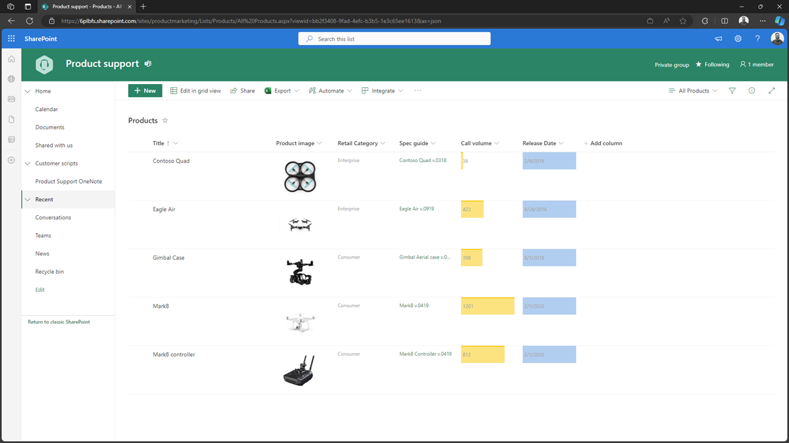

---
lab:
  title: 演習 3 - SharePoint Online から製品情報を取得する
  module: 'LAB 03: Connect Copilot for Microsoft 365 to your external data in real-time with message extension plugins built with .NET and Visual Studio'
---

# 演習 3 - SharePoint Online から製品情報を取得する

この演習では、製品情報を項目としてリストに格納する SharePoint Online サイトをプロビジョニングして構成します。 Microsoft Graph SDK を使用して SharePoint Online からリスト項目を取得し、検索結果にリスト項目データを返すように、メッセージ拡張機能コードを更新します。 最後に、メッセージ拡張機能を実行してデバッグし、Microsoft Teams でテストします。


## タスク 1 - 製品マーケティング SharePoint サイトをプロビジョニングして構成する

まず、SharePoint ルック ブック サービスを使用して SharePoint Online サイトを作成します。

Web ブラウザーで以下を行います。

1. **SharePoint のルック ブック** ([https://lookbook.microsoft.com](https://lookbook.microsoft.com)) に移動します
1. トップ ナビゲーションで、**[View the designs (デザインの表示)]** を展開します
1. **[View the designs (デザインの表示)]** メニューで、**[チーム]** を展開し、**[製品サポート]** を選択します
1. **[ Add your tenant (テナントの追加)] **を選択します
1. 指示された場合、テナントにサインインします。
1. アクセス許可の同意画面で、必要なアクセス許可を確認し、**[同意]** を選択して SharePoint ルック ブック サービスに戻ります。
1. フォームでデフォルトをそのまま使用し、**[プロビジョニング]** を選択します

サイトのプロビジョニングが完了したときに、それを通知する電子メールがメール アドレスに送信されます。 このプロセスが完了するまでに数分かかることがあります。



Microsoft Graph API を使用してリストに対してクエリを実行するときに、[タイトル] 列と [小売カテゴリ] 列でフィルター処理を有効にするには、リストにインデックスを作成します。

Web ブラウザーでの続行:

1. **製品サポート** サイト (**<https://tenant.sharepoint.com/sites/productmarketing>**) に移動し、**[テナント]** を SharePoint Online インスタンスの名前に置き換えます
1. **Microsoft 365 スイート バー**で、**設定歯車**を選択して、[設定] サイド パネルを開きます。
1. **[SharePoint]** 見出しの下にある ** [サイトの内容]** を選択します
1. リストとライブラリの一覧で、**Products** リストにカーソルを合わせ、**3 つのドット**アイコンを選択して **[Show acctions (アクションの表示)]** メニューを展開し、 **[設定]** を選択します。
1. **[列]** セクションの列の一覧で、 **インデックス付きの列**を選択します
1. **[Create a new index (新しいインデックスの作成)] **を選択します

## タスク 2 - SharePoint ホスト名とサイト URL 環境変数を追加する

次に、SharePoint Online インスタンスのホスト名と製品サポート サイトの URL を環境変数として一元化します。 その後、実行時に使用する環境変数として値を公開し、値を読み取るようにコードを更新します。

Visual Studio を開きます。

1. **env** フォルダーで、**.env.local** という名前のファイルを開きます
1. ファイルで、**SPO_HOSTNAME** と **SPO_SITE_URL** 環境変数を追加し、 **テナント** を SharePoint Online インスタンスの名前に置き換えます。

    ```text
    SPO_HOSTNAME=tenant.sharepoint.com
    SPO_SITE_URL=sites/productmarketing
    ```

1. 変更を保存します

次に、アクションを更新して、環境変数をアプリ設定ファイルに書き込みます。

1. プロジェクトのルート フォルダーで、**teamsapp.local.yml** という名前のファイルを開きます
1. **./appsettings.Development.json** ファイルを対象とする **file/createOrUpdateJsonFile** アクションを使用する手順を見つけます。
1. ファイルで、**content** 配列を更新し、 **SPO_HOSTNAME** 変数と **SPO_SITE_URL** 変数を追加します。

    ```yml
      - uses: file/createOrUpdateJsonFile
        with:
          target: ./appsettings.Development.json
          content:
            BOT_ID: ${{BOT_ID}}
            BOT_PASSWORD: ${{SECRET_BOT_PASSWORD}}
            CONNECTION_NAME: ${{CONNECTION_NAME}}
            SPO_HOSTNAME: ${{SPO_HOSTNAME}}
            SPO_SITE_URL: ${{SPO_SITE_URL}}
    ```

1. 変更を保存します

次に、ConfigOptions クラスを更新して新しい環境変数を含めます

1. プロジェクトのルート フォルダーで、Config.cs を開きます
1. ConfigOptions クラスで、SPO_HOSTNAME と SPO_SITE_URL という名前を持つ新しい文字列プロパティを追加します

    ```csharp
    public class ConfigOptions
    {
      public string BOT_ID { get; set; }
      public string BOT_PASSWORD { get; set; }
      public string CONNECTION_NAME { get; set; }
      public string SPO_HOSTNAME { get; set; }
      public string SPO_SITE_URL { get; set; }
    }
    ```

1. 変更を保存します

次に、2 つの環境変数でアプリ構成を更新します。

1. プロジェクトのルート フォルダーで Program.cs を開きます
1. 新しい行を追加して、SPO_HOSTNAME と SPO_SITE_URL 環境変数をアプリ構成設定として追加します。

    ```csharp
    var config = builder.Configuration.Get<ConfigOptions>();
    builder.Configuration["MicrosoftAppType"] = "MultiTenant";
    builder.Configuration["MicrosoftAppId"] = config.BOT_ID;
    builder.Configuration["MicrosoftAppPassword"] = config.BOT_PASSWORD;
    builder.Configuration["CONNECTION_NAME"] = config.CONNECTION_NAME;
    builder.Configuration["SPO_HOSTNAME"] = config.SPO_HOSTNAME;
    builder.Configuration["SPO_SITE_URL"] = config.SPO_SITE_URL;
    ```

1. 変更を保存します

最後の手順では、ボット アクティビティ ハンドラーを更新して、アプリ構成から値を読み取り、その値を読み取り専用プロパティに保存することです。

1. 検索フォルダーで、SearchApp.cs という名前のファイルを開きます
1. SearchApp クラスで、spoHostname と spoSiteUrl という名前の読み取り専用文字列プロパティを作成します

    ```csharp
    public class SearchApp : TeamsActivityHandler
    {
      private readonly string connectionName;
      private readonly string spoHostname;
      private readonly string spoSiteUrl;
    }
    ```

1. 挿入された App Configuration を使用してプロパティ値を設定するようにコンストラクターを更新します。

    ```csharp
    public SearchApp(IConfiguration configuration)
    {
        connectionName = configuration["CONNECTION_NAME"];
        spoHostname = configuration["SPO_HOSTNAME"];
        spoSiteUrl = configuration["SPO_SITE_URL"];
    } 
    ```

1. 変更を保存。

## タスク 3 - 検索コマンドの更新

メッセージ拡張機能が製品情報を返す場合は、検索コマンドのタイトルと説明を更新し、パラメータ名とその説明も更新します。

Visual Studio での続行:

1. **appPackage** フォルダーで、**manifest.json** という名前のファイルを開きます。
1. **composeExtensions** 配列で、コマンド オブジェクトを次に更新します。

    ```json
    "composeExtensions": [
      {
        "botId": "${{BOT_ID}}",
        "commands": [
          {
            "id": "Search",
            "type": "query",
            "title": "Products",
            "description": "Find products by name",
            "initialRun": false,
            "fetchTask": false,
            "context": [
              "commandBox",
              "compose",
              "message"
            ],
            "parameters": [
              {
                "name": "ProductName",
                "title": "Product name",
                "description": "The name of the product as a keyword",
                "inputType": "text"
              }
            ]
          }
        ]
      }
    ],
    ```

1. 変更を保存します

## タスク 4 - ユーザー クエリ値を取得する

OnTeamsMessagingExtensionQueryAsync メソッドが実行されると、まず、ユーザーが検索ボックスに入力した内容を理解します。

まず、既存のコードを削除しましょう。

Visual Studio での続行:

1. **Search** フォルダーで、**SearchApp.cs** という名前のファイルを開きます
1. **OnTeamsMessagingExtensionQueryAsync** メソッドで、アクセス トークンをチェックする **if** ステートメント**以降**のすべてのコードを削除します
1. **SearchApp** クラスで、**FindPackages** メソッドと **_adaptiveCardFilePath** プロパティを削除します。

既存のコードを削除すると、**SearchApp** クラスは次のコード スニペットのようになります。

```csharp
public class SearchApp : TeamsActivityHandler
{
    private readonly string connectionName;
    private readonly string spoHostname;
    private readonly string spoSiteUrl;

    public SearchApp(IConfiguration configuration)
    {
        connectionName = configuration["CONNECTION_NAME"];
        spoHostname = configuration["SPO_HOSTNAME"];
        spoSiteUrl = configuration["SPO_SITE_URL"];
    }

    protected override async Task<MessagingExtensionResponse> OnTeamsMessagingExtensionQueryAsync(ITurnContext<IInvokeActivity> turnContext, MessagingExtensionQuery query, CancellationToken cancellationToken)
    {
        var userTokenClient = turnContext.TurnState.Get<UserTokenClient>();
        var tokenResponse = await GetToken(userTokenClient, query.State, turnContext.Activity.From.Id, turnContext.Activity.ChannelId, connectionName, cancellationToken);

        if (!HasToken(tokenResponse))
        {
            return await CreateAuthResponse(userTokenClient, connectionName, (Activity)turnContext.Activity, cancellationToken);
        }
    }
}
```

次に、**ProductName** パラメータの値を取得するコードを記述します。

1. **OnTeamsMessagingExtensionQueryAsync** メソッドで、**MessagingExtensionQuery** オブジェクトの **Parameters** 配列から **ProductName** パラメータの値を取得するコードを追加します。

    ```csharp
    var name = GetQueryData(query.Parameters, "ProductName");
    ```

1. **SearchApp** クラスで、**GetQueryData** メソッドを実装します。

    ```csharp
    private static string GetQueryData(IList<MessagingExtensionParameter> parameters, string key)
    {
      if (parameters.Any() != true)
      {
        return string.Empty;
      }
    
      var foundPair = parameters.FirstOrDefault(pair => pair.Name == key);
      return foundPair?.Value?.ToString() ?? string.Empty;
    }
    ```

1. 変更を保存します

**GetQueryData** メソッドは、**MessagingExtensionParameter** オブジェクトの一覧から特定のキーに関連付けられた値を取得するために使用されます。 **MessagingExtensionQuery** オブジェクト内のパラメータ配列からデータを抽出する便利な方法を提供します。

## タスク 5 - SharePoint リスト クエリの OData フィルターを作成する

ユーザーによって渡された値が得られたので、この値を使用して OData クエリ フィルターを作成します。 このフィルターは、製品名を含む [タイトル] 列で SharePoint Online リストのクエリを実行するために使用されます。

Visual Studio での続行:

1. **OnTeamsMessagingExtensionQueryAsync** メソッドに、**filterQuery** 変数を作成するコードを追加します。

    ```csharp
    var nameFilter = !string.IsNullOrEmpty(name) ? $"startswith(fields/Title, '{name}')" : string.Empty;
    var filters = new List<string> { nameFilter };
    var filterQuery = filters.Count == 1 ? filters.FirstOrDefault() : string.Join(" and ", filters);
    ```

1. 変更を保存します

このコードは、**name** パラメータに基づいてフィルター クエリを構築します。 name パラメータを指定すると、指定された名前で始まる **Title** フィールドを持つ項目を検索するフィルター式が作成されます。 name パラメータが指定されていない場合は、フィルター クエリとして空の文字列が割り当てられます。 結果のフィルター クエリは、コードの後半で SharePoint サイトからフィルター処理された項目を取得するために使用されます。

## タスク 6 - Microsoft Graph SDK をインストールして構成する

Microsoft Graph に対して認証された要求を実行するには、 **Microsoft Graph SDK** を使用します。

NuGet から Microsoft Graph SDK パッケージをインストールし、**TokenProvider** クラスを作成します。これにより、トークン サービスから取得したアクセス トークンを使用し、新しい **GraphServiceClient**を初期化できます。

Visual Studio での続行:

1. Solution Explorer で、**MsgExtProductSupport** プロジェクトを右クリックします
1. **[NuGet パッケージの管理]** を選択します
1. **[参照]** タブを選択して、「**Microsoft.Graph**」を検索します
1. 結果の一覧で、**Microsoft.Graph** を選択します
1. **[バージョン]** ドロップダウン リストで、**5.42.0** を選択します
1. **[インストール]** を選択します。
1. **[ライセンスの同意]** ダイアログで、**[同意する]** を選択して SDK をインストールします

パッケージをインストールしたら、Microsoft Graph SDK のトークン プロバイダーを作成します。

1. **Search** フォルダーに、**TokenProvider.cs** という名前の新しいファイルを作成します
1.  ファイルに、次のコードを追加します。

    ```csharp
    using Microsoft.Kiota.Abstractions.Authentication;
    
    namespace MsgExtProductSupport.Search
    {
       public class TokenProvider : IAccessTokenProvider
        {
            public string Token { get; set; }
            public AllowedHostsValidator AllowedHostsValidator => throw new NotImplementedException();
    
            public Task<string> GetAuthorizationTokenAsync(Uri uri, Dictionary<string, object>? additionalAuthenticationContext = null, CancellationToken cancellationToken = default)
            {
                return Task.FromResult(Token);
            }
        }
    }
    ```

1. 変更を保存します

次に、新しい **GraphServiceClient** インスタンスを作成するメソッドを作成します。

1. **Search** フォルダーで、**SearchApp.cs** という名前のファイルを開きます
1. ファイルで、必要な名前空間をインポートします。

    ```csharp
    using Microsoft.Graph;
    using Microsoft.Kiota.Abstractions.Authentication;
    ```

1. **OnTeamsMessagingExtensionQueryAsync** メソッドで、Microsoft Graph に要求を送信するために使用する新しい Graph クライアントを作成するコードを追加します

    ```csharp
    var graphClient = CreateGraphClient(tokenResponse);
    ```

1. **SearchApp** クラスで、**CreateGraphClient** メソッドを実装します

    ```csharp
    private static GraphServiceClient CreateGraphClient(TokenResponse tokenResponse)
    {
      TokenProvider provider = new() { Token = tokenResponse.Token };
      var authenticationProvider = new BaseBearerTokenAuthenticationProvider(provider);
      var graphClient = new GraphServiceClient(authenticationProvider);
      return graphClient;
    }
    ```

1. 変更を保存します

このコードでは、認証プロバイダーを設定し、指定されたアクセス トークンを使用して Microsoft Graph API と対話するために使用できるクライアント オブジェクトを作成します。

## タスク 7 - 製品一覧のクエリを実行する

製品リスト内の項目を照会し、後で検索結果を作成するには、GraphServiceClient を使用して SharePoint Online から製品データを取得する要求を送信します。

Visual Studio での続行:

**OnTeamsMessagingExtensionQueryAsync** メソッドで、SharePoint データを取得するコードを追加します。

  ```csharp
  var site = await GetSharePointSite(graphClient, spoHostname, spoSiteUrl, cancellationToken);
  var drive = await GetSharePointDrive(graphClient, site.SharepointIds.SiteId, "Product Imagery", cancellationToken);
  var items = await GetProducts(graphClient, site.SharepointIds.SiteId, filterQuery, cancellationToken);
  ```

このコードでは次のことを行います。

- **Product Marketing サイトを取得**すると、サイト オブジェクトには SharePoint サイトの ID が含まれています。この ID は、サイト内のオブジェクトの取得とクエリに使用されます
- **Product Imagery ドライブを取得**、ドライブは製品イメージを含むドキュメント ライブラリを表します。 後でドライブを使用して、検索結果に表示する製品イメージを取得します
- **製品を取得**、ユーザー クエリに基づいて製品一覧のクエリを実行するために使用します

**SearchApp** クラスに 3 つのメソッドを実装します。

- **GetSharePointSite** メソッドを実装する

    ```csharp
    private static async Task<Site> GetSharePointSite(GraphServiceClient graphClient, string hostName, string siteUrl, CancellationToken cancellationToken)
    {
        return await graphClient.Sites[$"{hostName}:/{siteUrl}"].GetAsync(r => r.QueryParameters.Select = new string[] { "sharePointIds" }, cancellationToken);
    }
    ```

このメソッドは、GraphServiceClient を使用して、パスを使用してサイト オブジェクトを返す要求を Microsoft Graph に送信します。 パスは、SharePoint Online のホスト名とサイト URL を組み合わせて作成されます。 sharePointIds プロパティ値のみが必要であるため、Select クエリ パラメータは、応答でこのプロパティのみを返すように構成されます。

- **GetSharePointDrive** メソッドを実装する

    ```csharp
    private static async Task<Drive> GetSharePointDrive(GraphServiceClient graphClient, string siteId, string name, CancellationToken cancellationToken)
    {
        var drives = await graphClient.Sites[siteId].Drives.GetAsync(r => r.QueryParameters.Select = new string[] { "id", "name" }, cancellationToken);
        var drive = drives.Value.Find(d => d.Name == name);
        return drive;
    }
    ```

このメソッドは、GraphServiceClient とサイト ID を使用してサイトからドキュメント ライブラリのコレクションを返し、各ドキュメント ライブラリの ID と名前のプロパティを返します。 その後、ライブラリのコレクションがフィルター処理され、name メソッド パラメータと同じ名前のドライブが返されます。

- **GetProducts** メソッドを実装する

    ```csharp
    private static async Task<SiteCollectionResponse> GetProducts(GraphServiceClient graphClient, string siteId, string filterQuery, CancellationToken cancellationToken)
    {
        var fields = new string[]
        {
            "fields/Id",
            "fields/Title",
            "fields/RetailCategory",
            "fields/PhotoSubmission",
            "fields/CustomerRating",
            "fields/ReleaseDate"
        };
    
        var request = graphClient.Sites.WithUrl($"https://graph.microsoft.com/v1.0/sites/{siteId}/lists/Products/items?expand={string.Join(",", fields)}&$filter={filterQuery}");
        return await request.GetAsync(null, cancellationToken);
    }
    ```

このメソッドは、GraphServiceClient を使用して、渡されたフィルター クエリを使用して Products リストからフィルター処理されたリスト アイテムを返し、フィールド配列で定義されているリスト アイテム データを返します。

## タスク 8 - 検索結果を作成する

SharePoint から製品を取得した後、検索結果を作成します。検索結果はユーザーに返されます。

検索結果の作成は、項目配列の反復処理で構成されます。各項目に対して、プレビューカードとコンテンツ カードを含む MessagingExtensionAttachment を作成します。

項目を反復処理する前に、ループで使用するアダプティブ カード テンプレートを作成します。

Visual Studio での続行:

1. **Resources** フォルダーに、**Product.json** という名前の新しいファイルを作成します

    ```json
    {
      "type": "AdaptiveCard",
      "$schema": "http://adaptivecards.io/schemas/adaptive-card.json",
      "version": "1.6",
      "body": [
        {
          "type": "TextBlock",
          "text": "${Product.Title}",
          "wrap": true,
          "style": "heading"
        },
        {
          "type": "TextBlock",
          "text": "${Product.RetailCategory}",
          "wrap": true
        },
        {
          "type": "Container",
          "items": [
            {
              "type": "Image",
              "url": "${ProductImage}",
              "altText": "${Product.Title}"
            }
          ],
          "minHeight": "350px",
          "verticalContentAlignment": "Center",
          "horizontalAlignment": "Center"
        },
        {
          "type": "FactSet",
          "facts": [
            {
              "title": "Call Volume",
              "value": "${formatNumber(Product.CustomerRating,0)}"
            },
            {
              "title": "Release Date",
              "value": "${formatDateTime(Product.ReleaseDate,'dd/MM/yyyy')}"
            }
          ]
        },
        {
          "type": "ActionSet",
          "actions": [
            {
              "type": "Action.OpenUrl",
              "title": "View",
              "url": "https://${SPOHostname}/${SPOSiteUrl}/Lists/Products/DispForm.aspx?ID=${Product.Id}"
            }
          ]
        }
      ]
    }
    ```

このテンプレートでは、アダプティブ カードのレンダリング時に実際の値に置き換えられるデータ バインディング式が使用されます。 カードがレンダリングされると、いくつかの製品情報、製品イメージ、およびアクション ボタンが含まれます。 アクション ボタンをクリックすると、ブラウザーが開き、製品品目の SharePoint リスト表示フォームに移動されます。

次に、JSON ファイルをアダプティブ カード テンプレートに変換するコードを追加します。

1. **Search** フォルダーで、**SearchApp.cs** を開きます
1. ファイルで、必要な名前空間をインポートします。

    ```csharp
    using AdaptiveCards.Templating;
    ```

1. **OnTeamsMessagingExtensionQueryAsync** メソッドで、JSON ファイルの内容を読み取るコードを追加し、新しい **AdaptiveCardTemplate** オブジェクトを作成します。

    ```csharp
    var card = File.ReadAllText(@"Resources\Product.json");
    var template = new AdaptiveCardTemplate(card);
    ```

1. 変更を保存します

次に、リスト項目を反復処理するループを作成します。 各反復では、次の処理が行われます。

- 現在の項目データを Product オブジェクトに逆シリアル化する
- 製品イメージのサムネイルを取得する
- コンテンツ カードを作成する
- プレビュー カードを作成する
- コンテンツ カードとプレビュー カードを組み合わせた MessagingExtensionAttachment を作成する
- MessagingExtensionAttachment を一覧に追加する

ループが完了すると、ユーザーに返すことができる添付ファイルの一覧が得られます。

1. **Search** フォルダーで、**SearchApp.cs** を開きます
1. **OnTeamsMessagingExtensionQueryAsync** メソッドで、新しいリストを作成するコードを追加し、**MessagingExtensionAttachment** オブジェクトを格納します。

    ```csharp
    var attachments = new List<MessagingExtensionAttachment>();
    ```

1. リスト項目を反復処理する foreach ループを作成します。

    ```csharp
    foreach (var item in items.Value) { 
            
    }
    ```

1. foreach ループに次のコードを追加します。

    ```csharp
    var product = JsonConvert.DeserializeObject<Product>(item.AdditionalData["fields"].ToString());
    product.Id = item.Id;
    
    var thumbnails = await GetThumbnails(graphClient, drive.Id, product.PhotoSubmission, cancellationToken);
    
    var resultCard = template.Expand(new
    {
      Product = product,
      ProductImage = thumbnails.Large.Url,
      SPOHostname = spoHostname,
      SPOSiteUrl = spoSiteUrl,
    });
    
    var previewcard = new ThumbnailCard
    {
      Title = product.Title,
      Subtitle = product.RetailCategory,
      Images = new List<CardImage> { new() { Url = thumbnails.Small.Url } }
    }.ToAttachment();
    
    var attachment = new MessagingExtensionAttachment
    {
      Content = JsonConvert.DeserializeObject(resultCard),
      ContentType = AdaptiveCard.ContentType,
      Preview = previewcard
    };
    
    attachments.Add(attachment);
    ```

1. 変更を保存します

リスト項目データを厳密に型指定するには、**製品**を表すモデルを作成します。

1. プロジェクトのルート フォルダーに **Models** という名前の新しいフォルダーを作成します
1. **Models** フォルダーに **Product.cs** という名前の新しいファイルを作成します

    ```csharp
    namespace MsgExtProductSupport.Models
    {
        public class Product
        {
            public string Title { get; set; }
            public string RetailCategory { get; set; }
            public Link Specguide { get; set; }
            public string PhotoSubmission { get; set; }
            public double CustomerRating { get; set; }
            public DateTime ReleaseDate { get; set; }
            public string Id { get; set; }
            public string ContentType { get; set; }
            public DateTime Modified { get; set; }
            public DateTime Created { get; set; }
        }
    
        public class Link
        {
            public string Description { get; set; }
            public string Url { get; set; }
        }
    }
    ```

1. 変更を保存します

次に、**GetThumbnails** メソッドを実装して、製品のサムネイル画像を Microsoft Graph から取得します

1. **Search** フォルダーで、**SearchApp.cs** という名前のファイルを開きます
1. **SearchApp** クラスで、**GetThumbnails** メソッドを作成します

    ```csharp
    private static async Task<ThumbnailSet> GetThumbnails(GraphServiceClient graphClient, string driveId, string photoUrl, CancellationToken cancellationToken)
    {
        var fileName = photoUrl.Split('/').Last();
        var driveItem = await graphClient.Drives[driveId].Root.ItemWithPath(fileName).GetAsync(null, cancellationToken);
        var thumbnails = await graphClient.Drives[driveId].Items[driveItem.Id].Thumbnails["0"].GetAsync(r => r.QueryParameters.Select = new string[] { "small", "large" }, cancellationToken);
        return thumbnails;
    }
    ```

1. 変更を保存します

**GetThumbnails** メソッドは、Microsoft Graph API の Thumbnails エンドポイントを使用して、SharePoint に格納されている製品イメージの小さいサムネイルと大きいサムネイルを返します。

## タスク 9 - 検索結果を返す

MessagingExtensionResult オブジェクトのコレクションが作成されたので、それらを検索結果としてユーザーに返すことができます。

- **OnTeamsMessagingExtensionQueryAsync** メソッドで、メッセージ拡張機能の応答として検索結果を返すコードを追加します。

    ```csharp
    return new MessagingExtensionResponse
    {
      ComposeExtension = new MessagingExtensionResult
      {
        Type = "result",
        AttachmentLayout = "list",
        Attachments = attachments
      }
    };
    ```

## タスク 10 - リソースをプロビジョニングする

リソースをプロビジョニングするには、Teams アプリの依存関係の準備プロセスを実行します。

Visual Studio での続行:

1. **Solution Explorer** で、**MsgExtProductSupport** プロジェクトを右クリックします
1. **Teams Toolkit** メニューを展開し、**[Prepare Teams App Dependencies (Teams アプリの依存関係を準備)]** を選択します
1. **Microsoft 365 アカウント**ダイアログで、**[続行]** を選択します
1. **[プロビジョニング]** ダイアログで、**[プロビジョニング]** を選択します。
1. **[Teams Toolkit warning (Teams Toolkit の警告)]** ダイアログで、**[プロビジョニング]** を選択します。
1. **[Teams Toolkit information (Teams Toolkit の情報]** ダイアログで、プロンプトを**閉じます**

## タスク 11 - 実行とデバッグ

次に、Web サービスを開始し、Microsoft Teams でメッセージ拡張機能をテストします。

Visual Studio での続行:

1. **F5** キーを押してデバッグ セッションを開始し、新しいブラウザー ウィンドウを開くと Microsoft Teams Web クライアントに移動されます。
1. Microsoft 365 アカウントの資格情報を入力し、Microsoft Teams に進みます。
1. アプリのインストール ダイアログで、**[追加]** を選びます。
1. 新規または既存の Microsoft Teams チャットを開きます
1. メッセージ作成領域で、**[...] **を選択します アプリのポップアップが開きます
1. アプリの一覧で **C[ontoso 製品]** を選択してメッセージ拡張機能を開きます
1. テキスト ボックスに **Mark8** と入力します。 **Mark8** と **Mark8 コントローラー**の 2 つの結果が表示されます
1. **Mark8** を選択して、作成メッセージ ボックスにカードを埋め込みます
1. **カードを含むメッセージ**を送信する
1. 送信したカードで、**[表示]** ボタンを選択して、新しいタブの [製品] リストに製品の SharePoint リスト アイテムを表示します

ブラウザーを閉じてデバッグ セッションを終了します。

[次の演習に進んでください...](./5-exercise-extend-optimize-message-extensions-copilot-microsoft-365.md)