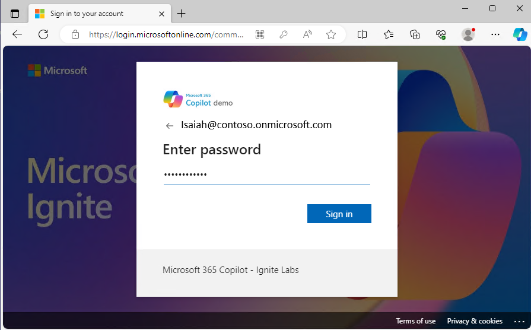
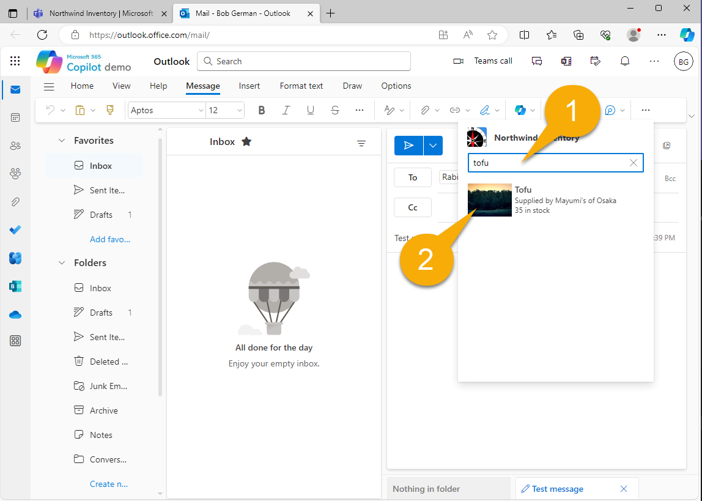

---
lab:
  title: 演習 1 - メッセージ拡張機能としてサンプルを実行する
  module: 'LAB 02: Build your own message extension plugin with TypeScript (TS) for Microsoft 365 Copilot'
---

# 演習 1 - メッセージ拡張機能としてサンプルを実行する

この演習では、Teams と Outlook のプラグインとしてアプリケーションを実行します。 さまざまなプロンプトを試し、さまざまなパラメータを使用してプラグインがどのように呼び出されるかを確認します。

## タスク 1 - プロジェクトを初回使用のために設定する

このプロジェクトでは、Northwind データベースは Azure Table Storage に格納されます。ローカルでデバッグするときは、[Azurite](https://learn.microsoft.com/azure/storage/common/storage-use-azurite?tabs=visual-studio) ストレージ エミュレーターが使用されます。 これは主にプロジェクトに組み込まれていますが、接続文字列を指定しない限り、プロジェクトはビルドされません。

Teams Toolkit は、環境変数を **env** フォルダーに格納し、プロジェクトを初めて開始するときにすべての値を自動的に入力します。 ただし、サンプル アプリケーションに固有の値が 1 つあります。Northwind データベースにアクセスするための接続文字列です。 必要な設定は、ファイル **env/.env.local.user.sample**で提供されます。 

このファイルのコピーを **env** フォルダーに作成し、それを **.env.local.user** と呼びます。 ここでは、シークレットまたは機密性の高い設定が格納されます。

Visual Studio Code でこれを行う方法がわからない場合: 

1. **env** フォルダーを展開し、**.env.local.user.sample** を右クリックします。 **コピー**を選択します。 

1. 次に、**env** フォルダー内の任意の場所を右クリックし、**[貼り付け]** を選択します。 **.env.local.user copy.sample** という名前の新しいファイルが作成されます。 

1. 同じコンテキスト メニューを使用して、ファイルの名前を **.env.local.user** に変更します。これで完了です。

    

結果の **.env.local.user** ファイルには、次の行が含まれている必要があります。

```console
SECRET_BOT_PASSWORD=
SECRET_STORAGE_ACCOUNT_CONNECTION_STRING=UseDevelopmentStorage=true
```

## タスク 2: アプリをローカルで実行する

1. Visual Studio Code で**作業フォルダー**が開いている状態で、**F5** キーを押してデバッグを開始するか、開始ボタン 1️⃣ を選択します。

1. **[Debug in Teams (Edge) (Teams でデバッグ (Edge)]** 2️⃣を選択します。

    

    初めてアプリを実行するときに、NodeJS がファイアウォールを通過することを許可するように求められる場合があります。これは、アプリケーションが通信できるようにするために必要です。

    すべての npm パッケージを初めて読み込むのに、時間がかかる場合があります。 最終的に、ブラウザー ウィンドウが開き、サインインするように促されます。

    

    サインインすると、Microsoft Teams が開き、アプリケーションをインストールするためのダイアログ オファリングが表示されます。 表示される情報を観察します。これは、 **アプリ マニフェスト**から派生しています。

1. **[追加]** を選択して、個人用アプリケーションとして Northwind Inventory を追加します。

    ![大きな [追加] ボタンが表示されたアプリのインストール画面のスクリーンショット。](../media/2-02-run-project-04.png)

> [!NOTE]
> この画面が表示される場合は、**env/.env.local.user** ファイルを修正する必要があります。これは前のタスクで説明しています。
>
> 

アプリケーション内のチャットに転送する必要があります。ただし、任意のチャットでアプリを使用できます。

## タスク 3 - Microsoft Teams でボットをテストする

1. **Northwind Inventory チャット**で、製品を参照するメッセージの入力を開始します 1️⃣。 次に、製品のアダプティブ カードを挿入するには、**+** 2️⃣ を選択します。 

1. ポップアップ パネルで、インストールした **Northwind Inventory** アプリケーションを選択します 3️⃣。

    ![[+] を選択してメッセージ拡張パネルを開くスクリーンショット。](../media/2-03-test-message-extension-teams-take-2-01.png)

  2 つのタブ 1️⃣ を含む検索ダイアログが表示されます。 **[製品在庫]** タブでは、名前で製品を検索できます。

1. 検索ボックス 2️⃣ に、製品名、または **chai** などの製品名の始まりを入力します。 最初の文字を入力しながら一時停止すると、同じ文字で始まる製品の選択肢が増えます。

1. **Chai** 3️⃣ を選択して、コメントと共にアダプティブ カードをスレッドに挿入します。

    

1. カードは表示できますが、送信するまで使用できません。 メッセージの最終編集を行い、**[送信]** を選択します。 注文 1️⃣ に chai がないことに注意してください。 Chai の常連客がいつ来るかわからないので、もっと注文した方がよいでしょう！ 

    

    > [!NOTE]
    > アダプティブ カードアクションは、カードを送信するまで機能しません。 エラーが発生した場合は、メッセージを送信し、送信後にカードを操作していることを確認してください。

1. **[アクションの実行]** ボタン 2️⃣ を選択して、子カードを開きます。 数量 3️⃣ を入力し、 **[補充]** ボタン 4️⃣ を選択します。 カードは、成功メッセージと更新された注文単位数で更新されます。

    

他の 2 つのボタンを使用して、注文を取り消したり、在庫レベルを変更したりできます。

## タスク 4 - 詳細クエリ

Visual Studio Code に戻り、**appPackage** ディレクトリで **manifest.json** という名前のアプリ マニフェスト ファイルを開きます。 アプリのインストール時に表示されたアプリ情報がすべてここにあることがわかります。 下にスクロールして `composeExtensions:` を見つけます。 

```json
"composeExtensions": [
    {
        "botId": "${{BOT_ID}}",
        "commands": [
            {
                "id": "inventorySearch",
                ...
                "description": "Search products by name, category, inventory status, supplier location, stock level",
                "title": "Product inventory",
                "type": "query",
                "parameters": [ ... ]
            },
            {
                "id": "discountSearch",
                ...
                "description": "Search for discounted products by category",
                "title": "Discounts",
                "type": "query",
                "parameters": [ ...]
            }
        ]
    }
],
```

> [!NOTE]
> Compose 拡張機能は、メッセージ拡張機能の旧称です。Northwind Inventory メッセージ拡張機能はここで定義されています。

まず、Microsoft Teamsによってプロビジョニングされた **bot ID ** があります。これは、Azure ボット チャネルを使用して、セキュリティで保護されたリアルタイム メッセージをアプリケーションと交換します。 Teams Toolkit によってボットが登録され、ID が入力されます。

次に、コマンドのコレクションを確認します。 これらは、Teams の検索ダイアログのタブに対応します。 このアプリケーションでは、コマンドは主に通常のユーザーよりも Copilot を意図しています。

名前で製品を検索したときに、最初のコマンドを既に実行しました。 他のコマンドを試すには、**[割引]** タブに **飲料**、**乳製品**、または **農産物**と入力すると、それらのカテゴリの割引製品が表示されます。 Copilot では、クエリを使用して、割引製品に関する質問に回答できます。

![[割引] タブで飲料を検索しているスクリーンショット。](../media/2-03-test-multi-02.png)

次に、最初のコマンドをもう一度確認します。 5 つのパラメータがあることがわかります。

```json
"parameters": [
    {
        "name": "productName",
        "title": "Product name",
        "description": "Enter a product name here",
        "inputType": "text"
    },
    {
        "name": "categoryName",
        "title": "Category name",
        "description": "Enter the category of the product",
        "inputType": "text"
    },
    {
        "name": "inventoryStatus",
        "title": "Inventory status",
        "description": "Enter what status of the product inventory. Possible values are 'in stock', 'low stock', 'on order', or 'out of stock'",
        "inputType": "text"
    },
    {
        "name": "supplierCity",
        "title": "Supplier city",
        "description": "Enter the supplier city of product",
        "inputType": "text"
    },
    {
        "name": "stockQuery",
        "title": "Stock level",
        "description": "Enter a range of integers such as 0-42 or 100- (for >100 items). Only use if you need an exact numeric range.",
        "inputType": "text"
    }
]
```

Teams では最初のパラメータのみを表示できます。Copilot では 5 つすべてを使用できるため、Northwind インベントリ データのより高度なクエリを実行できます。 Teams UI の制限に対する回避策として、**[Northwind Inventory]** タブでは、次の形式を使用して、最大 5 個のコンマ区切りパラメータを受け入れます。

```console
name,category,inventoryStatus,supplierCity,supplierName
```

![[Northwind Inventory] タブに複数のコンマ区切りフィールドを入力するスクリーンショット。](../media/2-03-test-multi-04.png)

クエリを入力するときは、上記の JSON の説明をよくお読みください。 次に示す用語を入力して、Visual Studio Code の [デバッグ コンソール] タブに注目してください。各クエリが実行されると、ここで表示されます。

- **_chai_** - **chai で始まる名前の製品を検索**。

- **_c,bev_** - **bev** で始まるカテゴリ内の製品と、 **c**で始まる名前を検索します。

- **_,,out,_**: 在庫切れの製品を見つけます。

- **_,,in,London_**: ロンドンのサプライヤーから注文されている製品を見つけます。

- **_tofu,produce,osaka_** - **大阪のサプライヤーと****tofu**で始まる名前を持つ **produce** カテゴリの製品を検索します。

各クエリ用語は、製品の一覧をフィルター処理します。 各クエリ用語の形式は任意です。各パラメータの説明で必ず Copilot に説明してください。

## タスク 5 - Microsoft Outlook でテストする

Microsoft Outlook でメッセージ拡張機能がどのように機能するかを確認できるように、簡単な回り道を見てみましょう。

1. まず、Microsoft 365 アプリ メニュー 1️⃣ を開き、**Outlook** 2️⃣ を選択します。

    

1. **[新規メール]** を選択して、電子メールの作成を開始します。

    

1. **受信者** 1️⃣ と **件名** 2️⃣ を追加し、メッセージの本文 3️⃣ にカーソルを置きます。 何かを入力することもできます。 準備ができたら、ツール バーから **[挿入]** を選択し、ツール バー 4️⃣ で **[アプリ]** を選択します。

    

1. **Northwind Inventory** アプリケーションを選択し、必要に応じて検索します。

    

1. 前と同様に **Chai** 1️⃣ を検索し、結果を選択してアダプティブ カード 2️⃣ を挿入します。

    

    

> [!NOTE]
> アダプティブ カードは、メッセージを送信するまで機能しません。 受信者は、Microsoft Outlook を使用していない場合はカードを表示できず、Northwind Inventory アプリを自分でインストールしていない場合は、カードに対してアクションを実行できません。

## タスク 6 - Azure Storage Explorer で Northwind データベースを表示する

Northwind データベースはファンシーではありませんが、実際のデータベースです。 データをピークまたは変更する場合:

1. Azurite の実行中に [Azure Storage Explorer](https://azure.microsoft.com/products/storage/storage-explorer/) を開きます (アプリを実行すると Azurite が自動的に開始されます)。

1. Northwind データを表示するには、**エミュレーターとアタッチ**、**ストレージ アカウント**、**エミュレーター: 既定のポート**、および**テーブル**を開きます。

    

このコードでは、各クエリの **Products** テーブルが読み取られますが、他のテーブルにはアプリの起動時にのみアクセスされます。 そのため、新しいカテゴリを追加する場合は、アプリを再起動して表示する必要があります。

## 作業を確認

この演習のすべてのタスクを実行した後は、Teams または Outlook 用の Microsoft 365 プラグインとして使用できる動作中のメッセージ拡張機能アプリケーションが必要です。

すべてが動作している場合、**Microsoft 365 Copilot** でサンプル アプリケーションを実行する準備ができています。 

[次の演習に進んでください...](./4-exercise-2-run-copilot-plugin.md)
