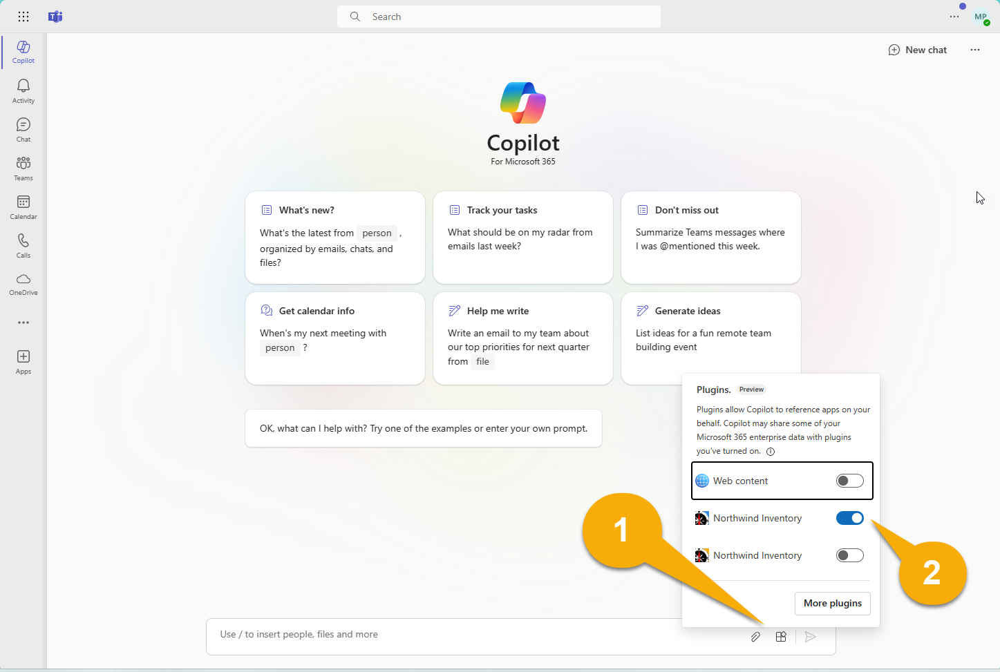
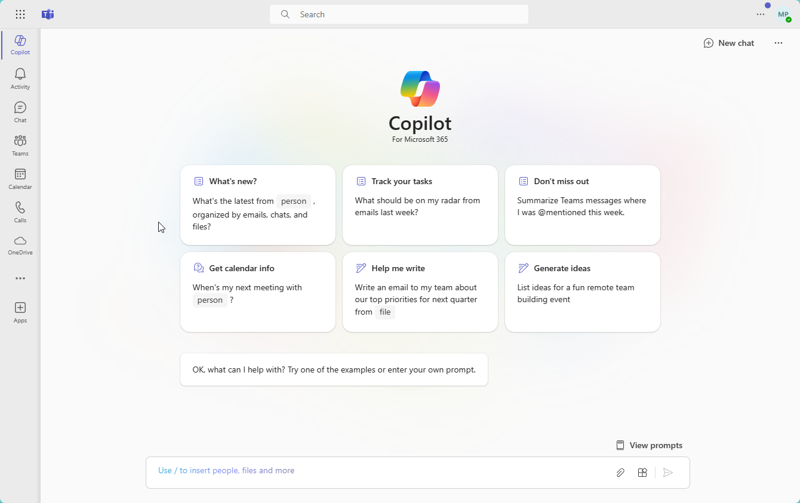
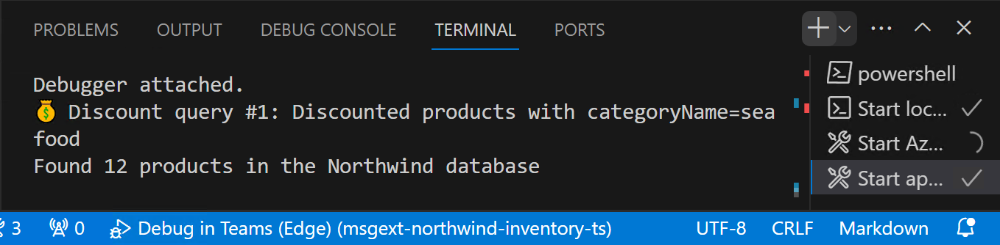

---
lab:
  title: 演習 2 - Copilot プラグインとしてサンプルを実行する
  module: 'LAB 02: Build your own message extension plugin with TypeScript (TS) for Microsoft Copilot'
---

# 演習 2 - Copilot プラグインとしてサンプルを実行する

この演習では、Microsoft Copilot for Microsoft 365 のプラグインとしてアプリケーションを実行します。 さまざまなプロンプトを試し、さまざまなパラメータを使用してプラグインがどのように呼び出されるかを確認します。

> [!NOTE]  
> 次の演習を実行するには、お使いのアカウントに、Copilot for Microsoft 365 の有効なライセンスが必要です。

## タスク 1 - Microsoft Copilot for Microsoft 365 でテストする (単一パラメータ)

1. 左側のアプリケーション レールで、**Copilot** アプリを選択します。

1. 作成ボックスの右側で、**プラグイン**アイコン 1️⃣ を選択し、 **Northwind Inventory** プラグイン 2️⃣ を有効にします。

    

1. 最適な結果を得るには、各プロンプトまたは関連する一連のプロンプトの前に、右上にある**新しいチャット**アイコンを選択します。

    

1. メッセージ拡張機能の 1 つのパラメータのみを使用する次のプロンプトを試してください。

    - _Northwind Inventory で Chai に関する情報を検索します。_

    - _Northwind で割引されているシーフードを見つけます。製品、仕入先名、平均割引率、および期間ごとの収益を含むテーブルを表示します。_

最後のクエリでは、OneDrive にアップロードしたドキュメントを参照する必要があります。 テスト中は、Visual Studio Code 内でログ メッセージを確認してください。 Copilot がプラグインを呼び出してクエリを送信するタイミングを確認できる必要があります。 たとえば、**割引されたシーフード商品**を要求した後、Copilot は `discountSearch` コマンドを使用してこのクエリを発行しました。



Northwind データの引用は 3 つの形式で表示される場合があります。 参照が 1 つある場合、Copilot はカード全体を表示する可能性があります。


複数の参照がある場合、Copilot はそれぞれの横に小さな数値を表示することがあります。 これらの数値をポイントすると、アダプティブ カードを表示できます。 参照も応答の下に一覧表示されます。


これらのアダプティブ カードを試して、製品に対してアクションを実行します。 これは Copilot からの以前の応答には影響しません。

自由に自分のプロンプトを作成してみてください。 Copilot が必要な情報をプラグインにクエリできる場合にのみ機能することがわかります。 これにより、ユーザーが発行するプロンプトの種類を予測し、それぞれに対応する種類のクエリを提供する必要性が強調されます。 複数のパラメータがあると、より強力になります。

## タスク 2 - Microsoft Copilot for Microsoft 365 でテストする (複数のパラメータ)

この演習では、サンプル プラグインで複数パラメータ機能を実行するプロンプトをいくつか試します。 これらのプロンプトは、**アプリ マニフェスト**で定義されているように、**名前**、**カテゴリ**、**在庫状況**、**サプライヤーの市区町村**、**在庫レベル**で取得できるデータを要求します。

たとえば、**_100 個を超える在庫がある Northwind 飲料を探す_** とプロンプトしてみてください。 その応答を生成するには、Copilot が製品を識別する必要があります。

- カテゴリは**飲料**です。
  
  _AND_

- 在庫ステータスは**在庫あり**です。

  _AND_

- **在庫レベル**は **100** より大きいです。

ログ ファイルを見ると、Copilot がこの要件を理解し、最初のメッセージ拡張機能コマンドに 3 つのパラメータを入力できたことがわかります。


プラグイン コードは、3 つのフィルターをすべて適用し、4 つの製品の結果セットを提供します。 Copilot は、結果のアダプティブ カードに関する情報を使用して、次のような結果をレンダリングします。


このプロンプトでは、Copilot は、OneDrive ファイルを調べて、各サプライヤーの契約の支払い条件を見つけることもあります。 この場合、一部の参照には **Northwind Inventory** アイコンではなく **Word** アイコンが表示されます。


試してみる必要があるその他のプロンプトを次に示します。

- _在庫が少ない Northwind 乳製品を探します。製品、仕入先、在庫単位、注文時のテーブルを表示します。_

- _豆腐の一部注文を受けています。Northwind でサプライヤーを見つけ、在庫を要約したメールを下書きし、MOQ ポリシーに従って部分的な注文の送信を停止する必要があることを通知します。_

- _Northwind は、ロンドンの Microsoft Community Days にブースを設置します。地元のサプライヤーと製品を見つけて、LinkedIn に投稿してブースと製品を宣伝します。製品の美味しさを強調し、ブースに参加するよう人々に勧めます。_

- _ロンドンの Northwind で在庫が少ないが、ソーシャルメディアによって需要が高い飲料は何ですか。在庫を更新するには、製品の詳細を参照してください。_

最適なプロンプトはどれですか? 独自のプロンプトを作成して、ログ メッセージを確認して、Copilot がプラグインにアクセスする方法を確認してください。

### トラブルシューティングのヒント

プラグインのテスト中に課題に直面している場合は、**開発者モードを有効にすることができます**。 開発者モードは、プロンプトに応答するために Copilot オーケストレーターによって選択されたプラグインに関する情報を提供します。 また、プラグインで使用可能な関数と API 呼び出しの状態コードも表示されます。

開発者モードを有効にするには、Copilot に次のように入力します。

```console
-developer on
```

プロンプトを実行し、開発者モードで次のような結果を出力します。 


ご覧のように、Copilot によって生成された応答の下には、バックグラウンドで何が起こったかについての洞察に満ちた情報を提供するテーブルがあります。

- **[有効なプラグイン]** で、Copilot が Northwind Inventory プラグインが有効になっていることを確認できます。

- **[Matched Functions (一致した関数)]** では、Northwind Inventory プラグインが 3 つの関数 (`inventorySearch`、`discountSearch`、`companySearch`) を提供していると Copilot が判断していることがわかります。

- **[Selected functions for execution (実行用に選択された関数)]** で、プロンプトに応答する `inventorySearch` 関数が Copilot によって選択されていることがわかります。

- **[Function execution details (関数実行の詳細)]** では、プラグインによって Copilot エンジンに返される HTTP 応答など、実行に関するいくつかの詳細情報を確認できます。

## 作業を確認

この演習のタスクを完了すると、Copilot for Microsoft 365 で **Northwind Inventory** プラグインを使用できるようになります。 

この演習が完了したら、新しいコマンドをメッセージング拡張機能に追加して、プラグインの機能を拡張し、さらに多くのタスクを実行できます。 

[次の演習に進んでください。](./5-exercise-3-add-new-command.md)
