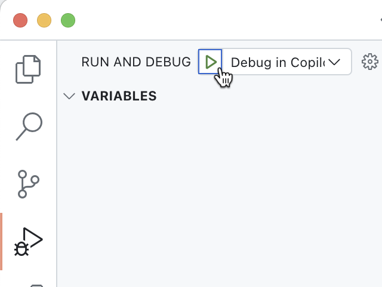
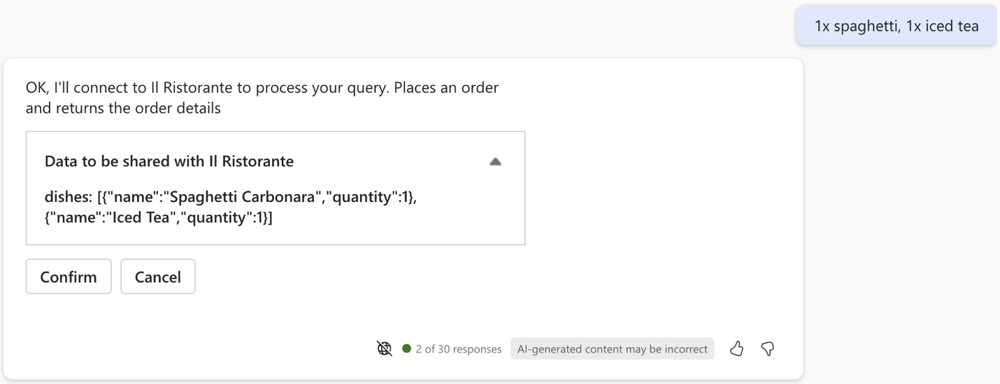

---
lab:
  title: 演習 4 - Microsoft 365 Copilot で API プラグインを使用した宣言型エージェントをテストする
  module: 'LAB 02: Build your first action for declarative agents with API plugin by using Visual Studio Code'
---

# 演習 4 - Microsoft 365 Copilot で API プラグインを使用した宣言型エージェントをテストする

宣言型エージェントをアクションで拡張すると、外部システムに格納されているデータをリアルタイムで取得および更新できます。 API プラグインを使用すると、API を介して外部システムに接続して情報を取得および更新できます。

### 演習の期間

- **推定所要時間**: 10 分

## タスク 1 - 宣言型エージェントをテストする

最後の手順では、Microsoft 365 Copilot の API プラグインを使用して宣言型エージェントをテストします。

Visual Studio Code:

1. **Activity Bar** で、**[Teams Toolkit]** を選択します。
1. **[Accounts]** セクションで、Microsoft 365 Copilot を使用して Microsoft 365 テナントにサインインしていることを確認します。

  ![Visual Studio Code での Teams Toolkit の [Accounts] セクションを示すスクリーンショット。](../media/LAB_02/3-teams-toolkit-accounts.png)

1. **Activity Bar** で **[Run and Debug]** を選択します。
1. **[Debug in Copilot]** の構成を選択し、**[Start Debugging]** ボタンを使用してデバッグを開始します。  

  

1. Visual Studio Code によってプロジェクトがビルドされ、Microsoft 365 テナントにデプロイされ、新しい Web ブラウザー ウィンドウが開きます。

Web ブラウザーで以下を行います。

1. メッセージが表示されたら、Microsoft 365 Copilot で Microsoft 365 テナントに属するアカウントでサインインします。
1. サイド バーから **[Il Ristorante]** を選択します。

  

1. **What's for lunch today?** の会話スターターを選択し、プロンプトを送信します。

  

1. メッセージが表示されたら、エージェントが API に送信するデータを調べて、**[Allow once]** ボタンを使用して確認します。

  

1. エージェントが応答するまで待ちます。 API から取得した情報の引用文献が表示されますが、ポップアップには料理名のみが表示されることに注意してください。 API プラグインではアダプティブ カード テンプレートが定義されていないため、追加情報は表示されません。

  

1. プロンプト テキスト ボックスに「**1x spaghetti, 1x iced tea**」と入力してプロンプトを送信し、注文します。
1. エージェントが API に送信するデータを調べて、**[Confirm]** ボタンを引き続き使用します。

  

1. エージェントが注文し、注文の概要を返すのを待ちます。 もう一度、エージェントにはアダプティブ カード テンプレートがないため、注文の概要がプレーン テキストで表示されていることに注意してください。

  

1. Visual Studio Code に戻り、デバッグを停止します。
1. **[ターミナル]** タブに切り替えて、アクティブなすべてのターミナルを閉じます。

  ![すべてのターミナルを閉じるオプションがある Visual Studio Code の [ターミナル] タブを示すスクリーンショット。](../media/LAB_02/3-visual-studio-code-close-terminal.png)
