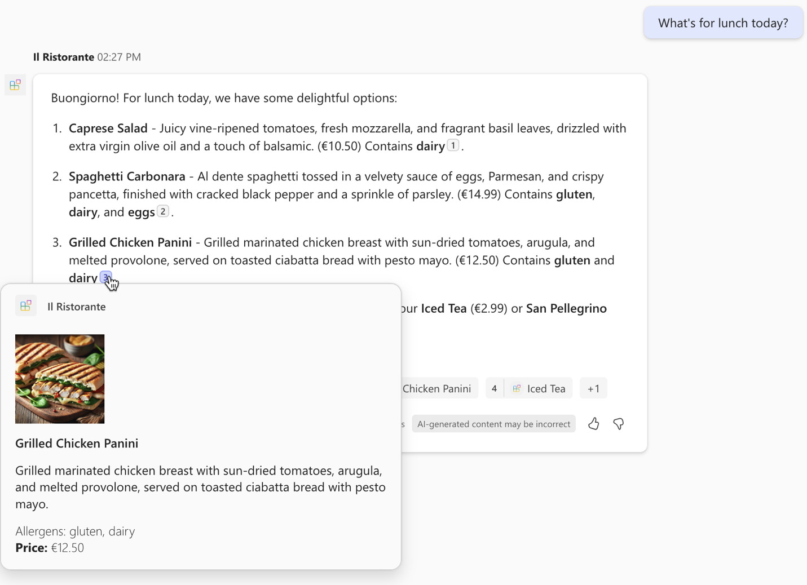

---
lab:
  title: 導入
  module: 'LAB 03: Use Adaptive Cards to show data in API plugins for declarative agents'
---

# はじめに

アクションを使用して宣言型エージェントを拡張することで、API を介して外部システムやサービスに接続できます。 エージェントを既存のシステムに接続すると、タスクを自動化し、自然言語を使用して分析情報を取得するのに役立ちます。 ユーザー エクスペリエンスを向上させるために、アダプティブ カードを使用して、エージェントが API から取得した情報を視覚的に魅力的な方法でレンダリングできます。

## シナリオ例

たとえば、最近、地元のレストランの API と統合する宣言型エージェントを構築したとします。 エージェントを使用すると、今日のメニューを閲覧したり、自然言語を使用して注文したりできます。 レストランの API には、料理、その食材、アレルギー物質の詳細な一覧が用意されています。 アダプティブ カードを使用して料理に関する情報をレンダリングすることで、エージェントの応答を強化する必要があります。 また、アダプティブ カードを使用して注文の概要をレンダリングして、注文を視覚的に表現する必要もあります。 アダプティブ カードを使用すると、画像、テキスト、ボタンを含め、情報をより魅力的にすることができます。

## 学習内容

このモジュールでは、宣言型エージェント用の既存の API プラグインを拡張し、アダプティブ カードを使用して API から受け取る情報をレンダリングします。 学習内容は、次のとおりです。

- **作成**: API からのデータを表示するアダプティブ カード テンプレートを作成します。
- **確認**: アダプティブ カード テンプレートによって API データが正しくレンダリングされることを確認します。
- **構成**: アダプティブ カード テンプレートを使用してデータをレンダリングするように API プラグインを設定します。
- **プロビジョニング**: 宣言型エージェントを Microsoft 365 Copilot にアップロードし、結果を検証します。

## ラボの期間

- **推定所要時間**: 35 分

## 学習の目的

このモジュールを完了すると、宣言型エージェントで使用するアダプティブ カード テンプレートを構築する方法がわかります。 テンプレートがデータを正しくレンダリングすることを確認し、テンプレートを使用するように API プラグインを構成できます。
