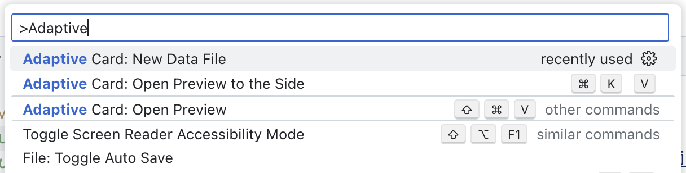
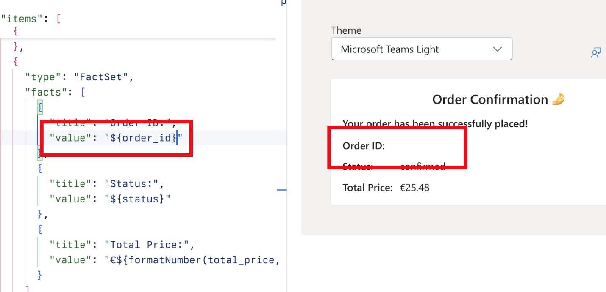

---
lab:
  title: 演習 1 - プロジェクトをダウンロードし、アダプティブ カードをビルドする
  module: 'LAB 03: Use Adaptive Cards to show data in API plugins for declarative agents'
---

# 演習 1 - プロジェクトをダウンロードし、アダプティブ カードをビルドする

まず、エージェントのアダプティブ カード テンプレートを作成して、応答にデータを表示してみましょう。 アダプティブ カード テンプレートをビルドするには、アダプティブ カード プレビューアーの Visual Studio Code 拡張機能を使用して、直接 Visual Studio Code で作業を簡単にプレビューします。 拡張機能を使用すると、データへの参照を含むアダプティブ カード テンプレートを作成できます。 実行時に、エージェントは API から取得したデータをプレースホルダーに入力します。

### 演習の期間

- **推定所要時間**: 10 分

## タスク 1 - スターター プロジェクトをダウンロードする

まず、サンプル プロジェクトをダウンロードします。 Web ブラウザーで以下を行います。

1. [https://github.com/microsoft/learn-declarative-agent-api-plugin-adaptive-cards-typescript](https://github.com/microsoft/learn-declarative-agent-api-plugin-adaptive-cards-typescript) に移動します。
  1. 手順に従って、コンピューターに[リポジトリのソース コードをダウンロード](https://docs.github.com/repositories/working-with-files/using-files/downloading-source-code-archives#downloading-source-code-archives-from-the-repository-view)します。
  1. ダウンロードした ZIP ファイルの内容をコンピューター上の **Documents フォルダー**に展開します。
  1. Visual Studio Code で  フォルダーを開きます。

サンプル プロジェクトは、API プラグインを使用して構築されたアクションを含む宣言型エージェントを含む Teams Toolkit プロジェクトです。 API プラグインは、プロジェクトにも含まれる Azure Functions で実行されている匿名 API に接続します。 API は架空のイタリア料理レストランに属しており、今日のメニューを参照して注文することができます。

## タスク 2 - 料理のアダプティブ カードをビルドする

まず、1 つの料理に関する情報を表示するアダプティブ カードを作成します。

Visual Studio Code:

1. **Explorer** ビューで、**cards** という名前の新しいフォルダーを作成します。
1. **cards** フォルダーに、**dish.json** という名前の新しいファイルを作成します。 空のアダプティブ カードを表す次の内容を貼り付けます。

  ```json
  {
    "$schema": "http://adaptivecards.io/schemas/adaptive-card.json",
    "type": "AdaptiveCard",
    "version": "1.5",
    "body": []
  }
  ```

1. 続行する前に、アクティビティ バーの **[Extensions]** タブで、**Adaptive Card Previewer** 拡張機能を検索してインストールし、アダプティブ カードのデータ ファイルを作成します。
  1. <kbd>Ctrl </kbd>+<kbd> P </kbd>キーを押してコマンド パレットを開きます。 「`>Adaptive`」と入力して、アダプティブ カードの操作に関連するコマンドを検索します。

    

  1. 一覧から **Adaptive Card: New Data File** を選択します。 Visual Studio Code では、**dish.data.json** という名前の新しいファイルを作成します。
  1. その内容を、料理を表すデータに置き換えます。

  ```json
  {
    "id": 4,
    "name": "Caprese Salad",
    "description": "Juicy vine-ripened tomatoes, fresh mozzarella, and fragrant basil leaves, drizzled with extra virgin olive oil and a touch of balsamic.",
    "image_url": "https://raw.githubusercontent.com/pnp/copilot-pro-dev-samples/main/samples/da-ristorante-api/assets/caprese_salad.jpeg",
    "price": 10.5,
    "allergens": [
    "dairy"
    ],
    "course": "lunch",
    "type": "dish"
  }
  ```

  1. 変更を保存します
1. **dish.json** ファイルに戻ります。
1. レンズから、**[アダプティブ カードの表示]** を選択します。

  

  Visual Studio Code によって、カードのプレビューがサイドに表示されます。 カードを編集すると、変更がすぐに横に表示されます。

1. **body** 配列に、**image_url** プロパティに格納されている画像 URL への参照を含む **Container** 要素を追加します。

  ```json
  {
    "type": "Container",
    "items": [
    {
      "type": "Image",
      "url": "${image_url}",
      "size": "large"
    }
    ]
  }
  ```

  カードのプレビューがカードを表示するように自動的に更新される方法に注目します。

  

1. 他の料理のプロパティへの参照を追加します。 完全なカードは以下のようになります。

  ```json
  {
    "$schema": "http://adaptivecards.io/schemas/adaptive-card.json",
    "type": "AdaptiveCard",
    "version": "1.5",
    "body": [
    {
      "type": "Container",
      "items": [
      {
        "type": "Image",
        "url": "${image_url}",
        "size": "large"
      },
      {
        "type": "TextBlock",
        "text": "${name}",
        "weight": "Bolder"
      },
      {
        "type": "TextBlock",
        "text": "${description}",
        "wrap": true
      },
      {
        "type": "TextBlock",
        "text": "Allergens: ${if(count(allergens) > 0, join(allergens, ', '), 'none')}",
        "weight": "Lighter"
      },
      {
        "type": "TextBlock",
        "text": "**Price:** €${formatNumber(price, 2)}",
        "weight": "Lighter",
        "spacing": "None"
      }
      ]
    }
    ]
  }
  ```

  

  アレルギー物質を表示するには、関数を使用して、アレルギー物質を文字列に結合することに注目します。 料理にアレルギー物質がない場合は、**表示されません**。 価格が適切に書式設定されるようにするには、カードに表示する小数点以下の桁数を指定できる **formatNumber** 関数を使用します。

## タスク 3 - 注文の概要のアダプティブ カードをビルドする

サンプル API を使用すると、ユーザーはメニューを参照して注文できます。 注文の概要を表示するアダプティブ カードを作成しましょう。

Visual Studio Code:

1. **cards** フォルダーに、**order.json**という名前の新しいファイルを作成します。 空のアダプティブ カードを表す次の内容を貼り付けます。

  ```json
  {
    "$schema": "http://adaptivecards.io/schemas/adaptive-card.json",
    "type": "AdaptiveCard",
    "version": "1.5",
    "body": []
  }
  ```

1. アダプティブ カードのデータ ファイルを作成します。
  1. キーボードの <kbd>Ctrl </kbd>+<kbd>P </kbd> (macOS の場合は <kbd>CMD </kbd>+<kbd> P</kbd>) を押して、コマンド パレットを開きます。 「`>Adaptive`」と入力して、アダプティブ カードの操作に関連するコマンドを検索します。

    

  1. 一覧から **Adaptive Card: New Data File** を選択します。 Visual Studio Code では、**order.data.json** という名前の新しいファイルが作成されます。
  1. その内容を、注文の概要を表すデータに置き換えます。

    ```json
    {
      "order_id": 6210,
      "status": "confirmed",
      "total_price": 25.48
    }
    ```

  1. 変更を保存します
1. **order.json** ファイルに戻ります。
1. レンズから、**[アダプティブ カードの表示]** を選択します。
1. 次に、**order.json** ファイルを開き、その内容を次のコードに置き換えます。

  ```json
  {
    "$schema": "http://adaptivecards.io/schemas/adaptive-card.json",
    "type": "AdaptiveCard",
    "version": "1.5",
    "body": [
    {
      "type": "TextBlock",
      "text": "Order Confirmation 🤌",
      "size": "Large",
      "weight": "Bolder",
      "horizontalAlignment": "Center"
    },
    {
      "type": "Container",
      "items": [
      {
        "type": "TextBlock",
        "text": "Your order has been successfully placed!",
        "weight": "Bolder",
        "spacing": "Small"
      },
      {
        "type": "FactSet",
        "facts": [
        {
          "title": "Order ID:",
          "value": "${order_id} "
        },
        {
          "title": "Status:",
          "value": "${status}"
        },
        {
          "title": "Total Price:",
          "value": "€${formatNumber(total_price, 2)}"
        }
        ]
      }
      ]
    }
    ]
  }
  ```

  前のセクションと同様に、カード上の各要素をデータ プロパティにマップします。

  

  > [!IMPORTANT]
  > **${order_id}** の後のスペースに注意します。 アダプティブ カードのレンダリング番号に関する既知の問題が原因で、これは意図的なものです。 テストするには、スペースを削除し、プレビューから数値が消えるのを確認します。
  >
  > 

  カードが正しく表示されるように、末尾のスペースを復元し、変更を保存します。