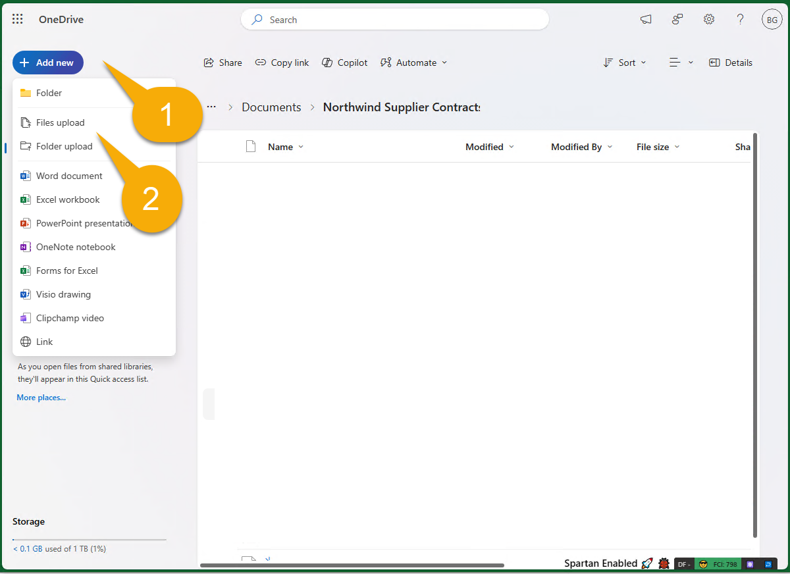
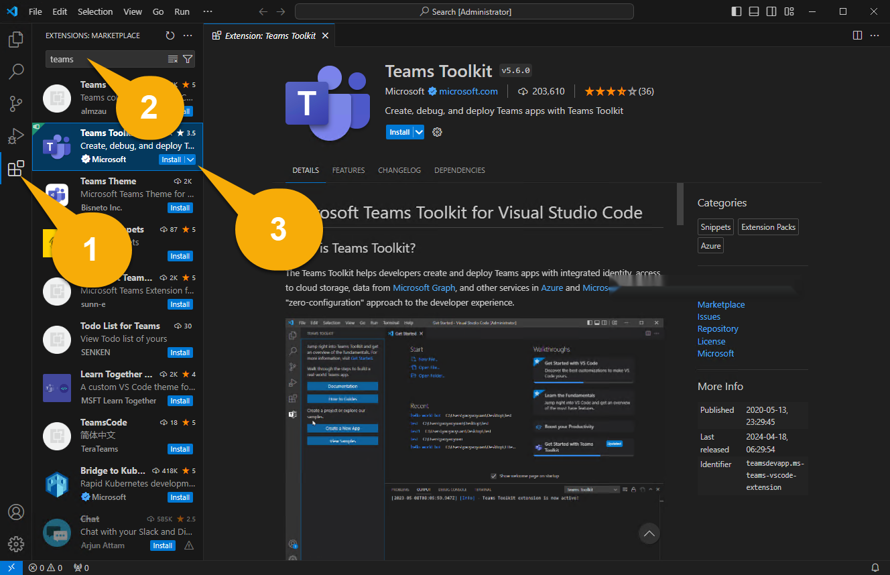

---
lab:
  title: 開発環境を準備する
  module: 'LAB 03: Build your own message extension plugin with TypeScript (TS) for Microsoft Copilot'
---

# 開発環境を準備する

まず、開発環境、アカウント、ソフトウェアを準備しましょう。 開始する前に、次のタスクを完了しておく必要があります。

## タスク 1: 前提条件をインストールする

> [!IMPORTANT]
> このプロジェクトを正常に完了するには、アプリケーションをアップロードするアクセス許可を持つ Microsoft 365 アカウントが必要です。 **演習 2**を完了するには、Microsoft Copilot for Microsoft 365 のアカウントのライセンスも持っている必要があります。

新しいテナントを使用している場合は、開始する前に、[https://office.com](https://office.com) の [Microsoft 365 ページ](https://office.com)にログインすることをお勧めします。 テナントの構成方法によっては、多要素認証の設定を求められる場合があります。 続行する前に、Microsoft Teamsと Microsoft Outlook にアクセスできることを確認します。

次のツールは、**MS-4010-DEVBOX** の課題で既にインストールされています。 インストールされ、操作可能であることを確認してください。

1. [Visual Studio Code](https://code.visualstudio.com/) (最新バージョン)

1. [Azure Storage Explorer](https://azure.microsoft.com/products/storage/storage-explorer/): このサンプルで使用されている Northwind データベースを表示および編集する場合は、これをダウンロードします。

## タスク 2 - nvm-windows をインストールする

このツールを使用して Node.js をインストールし、必要に応じてプロジェクトで必要な Node バージョンへの切り替えを行います。

1. Web ブラウザーで、[https://github.com/coreybutler/nvm-windows/releases](https://github.com/coreybutler/nvm-windows/releases) に移動します。
2. 最新のリリース バージョンを見つけて、ダウンロードする **nvm-setup.zip** ファイルを選択します。  ファイルがマシンにダウンロードされます。
3. ファイル フォルダーを開き、zip フォルダーの内容をマシン上のフォルダーに**展開**します。
4. 新しいフォルダーから **nvm-setup.exe** を選択してセットアップ ファイルを開きます。
5. インストーラーの指示に従って、既定のオプションを使用してツールをインストールします。
6. Nvm for Windows がマシンにインストールされます。

## タスク 3 - Node.js をインストールする

このコースのすべてのソリューションと互換性がある Node.js バージョン 18.18.2 をインストールします。

1. **コマンド プロンプト** アプリケーションを開きます。
2. コマンド `nvm install 18.18` を入力して Node.js をインストールします。
3. nvm 出力によって、インストールが完了したことが確認できるはずです。
4. コマンド `nvm use 18.18` を実行してこのバージョンの Node.js を使用します。
5. コマンド `node -v` を実行して、バージョン 18.18.2 がインストールされたことを確認します。

これで Node.js バージョン 18.18.2 のインストールと構成が完了しました

## タスク 4 - サンプル コードをダウンロードする

サンプル リポジトリを[クローン](https://github.com/OfficeDev/Copilot-for-M365-Plugins-Samples.git)または[ダウンロード](https://github.com/OfficeDev/Copilot-for-M365-Plugins-Samples.git)してください: [https://github.com/OfficeDev/Copilot-for-M365-Plugins-Samples/](https://github.com/OfficeDev/Copilot-for-M365-Plugins-Samples/)。

クローンまたはダウンロードしたリポジトリ内で、**samples/msgext-northwind-inventory-ts** フォルダーに移動します。 これらの課題では、これを「**作業フォルダー**」と呼びます。これは、作業する場所であるためです。

## タスク 3 - サンプル ドキュメントを OneDrive にコピーする

サンプル アプリケーションには、課題中に Copilot が参照するためのドキュメントがいくつか含まれています。 このタスクでは、これらのファイルをユーザーの OneDrive にコピーして、Copilot がファイルを見つけられるようにします。 テナントの設定方法によっては、このプロセスの一環として多要素認証を設定するように求められる場合があります。

1. Web ブラウザーを開き、Microsoft 365 ([https://www.office.com/](https://www.office.com/)) を参照します。 課題全体で使用する Microsoft 365 アカウントを使用してサインインします。 多要素認証を使用するように設定するよう求められることがあります。

1. ページ 1️⃣ の左上隅にあるアプリ メニューを使用して、Microsoft 365 2️⃣ 内の OneDrive アプリケーションに移動します。

    

1. OneDrive 内で、**My Files** 1️⃣ に移動します。 documents フォルダーがある場合は、さらにそこに移動します。 そうでない場合は、**My Files** の場所内で直接作業できます。

    

1. 次に **[新規追加]** 1️⃣ と **[フォルダー]** 2️⃣ を選択して新しいフォルダーを作成します。

    

1. フォルダーを **Northwind contracts** と名付けて、**[作成]** を選択します。

    

1. 次に、この新しいフォルダー内から **[新規追加]** 1️⃣ をもう一度選択しますが、今度は **[ファイルのアップロード]** 2️⃣ を選択します。

    

1. 次に、**作業フォルダー内**の **sampleDocs** フォルダーを参照します。 すべてのファイル 1️⃣ を強調表示し、**[OK]** 2️⃣ を選択してすべてをアップロードします。

    

このタスクを早期に実行することで、Microsoft 365 検索エンジンが準備が整うまでに検出される可能性が高くなります。

## タスク 4 - Teams Toolkit for Visual Studio Code をインストールして設定する

このタスクでは、現在のバージョンの [Teams Toolkit for Visual Studio Code](https://learn.microsoft.com/microsoftteams/platform/toolkit/teams-toolkit-fundamentals?pivots=visual-studio-code-v5) をインストールします。 これを行う最も簡単な方法は、Visual Studio Code 内から直接行うことです。

> [!NOTE]
> プレリリース バージョンは、この課題ではテストされていないため、インストールしないでください。

1. Visual Studio Code で**作業フォルダー**を開きます。 このフォルダーの作成者を信頼するように求められる場合があります。その場合は、実行してください。

1. 左サイド バーで **[拡張機能]** 1️⃣ を選択します。 検索ボックス 2️⃣ に「 **teams** 」と入力し、検索結果で **Teams Toolkit** を探します。 **[インストール]** 3️⃣ を選択します。

    

1. 次に、左側 の **Teams Toolkit** アイコン1️⃣ を選択します。 新しいプロジェクトを作成するためのオプションが提供されている場合は、おそらく間違ったフォルダーにいます。 **Visual Studio Code のファイル メニューで ****[フォルダーを開く]** を選択し、**msgext-northwind-inventory-ts** フォルダーを直接開きます。 次に示すように、アカウント、環境などのセクションが表示されます。

1. **[アカウント] **で** [Microsoft 365 にサインイン]** 2️⃣ を選択し、Microsoft 365 アカウントでサインインします。

    

1. ブラウザー ウィンドウが開き、Microsoft 365 にログインできます。 **[You are signed in now and close this page (サインしました。このページを閉じることができます)]** と表示されたら、それを行ってください。

1. 最後に、**[Sideloading enabled (サイドローディングが有効です)]** の横に緑色のチェックマークが表示されることを確認します。 そうでない場合は、ユーザー アカウントに Teams アプリケーションをアップロードするアクセス許可がないことを意味します。 このアクセス許可は、デフォルトでは「オフ」です。[ユーザーがカスタム アプリをアップロードできるようにするための手順](https://learn.microsoft.com/microsoftteams/teams-custom-app-policies-and-settings#allow-users-to-upload-custom-apps)はこちらです。

    

> [!NOTE]
> Microsoft 365 開発者プログラムには、Copilot for Microsoft 365 ライセンスは含まれていません。 そのため、開発者テナントを使用する場合は、メッセージ拡張機能としてのみサンプルをテストできます。

## 作業を確認

上記のすべてのタスクを実行すると、次がインストールされ、コンピューターにダウンロードされます。

- [Visual Studio Code](https://code.visualstudio.com/) (最新バージョン)

- [Node.js バージョン 18.x](https://nodejs.org/download/release/v18.18.2/)

- [Azure Storage Explorer](https://azure.microsoft.com/products/storage/storage-explorer/) (省略可)

- [Teams Toolkit for Visual Studio Code](https://learn.microsoft.com/microsoftteams/platform/toolkit/teams-toolkit-fundamentals?pivots=visual-studio-code-v5)

- サンプル リポジトリ: [https://github.com/OfficeDev/Copilot-for-M365-Plugins-Samples/](https://github.com/OfficeDev/Copilot-for-M365-Plugins-Samples/)

すべてが正しく準備されていれば、サンプル アプリケーションをメッセージ拡張機能として実行する準備が整いました。 

[次の演習に進んでください...](./3-exercise-1-run-message-extension.md)