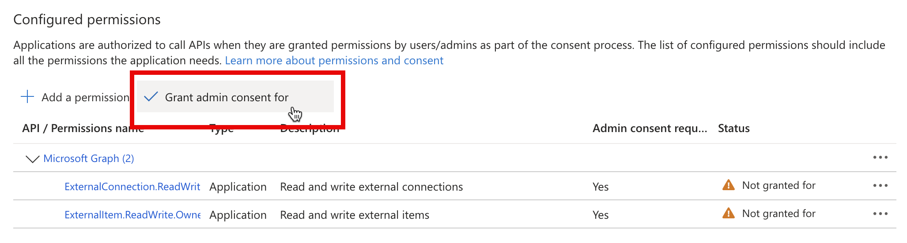

---
lab:
  title: '演習 1: Graph コネクタの外部接続を作成する'
  module: 'LAB 04: Add custom knowledge to declarative agents using Microsoft Graph connectors and Visual Studio Code'
---

# 演習 1: Graph コネクタの外部接続を作成する

宣言型エージェントをナレッジで拡張すると、大規模言語モデルの一部ではない追加情報にアクセスできます。 Graph コネクタを使用すると、外部データを Microsoft 365 に取り込むことができます。Microsoft 365 Copilot など、さまざまなユーザー エクスペリエンスで使用できます。 Copilot エージェントのナレッジ設定を構成するときに、Graph コネクタによって作成された外部接続と統合できます。

### 演習の期間

- **推定所要時間**: 10 分

## タスク 1: サンプル プロジェクトをダウンロードしてリソースに接続する

Copilot エージェントを Graph コネクタと統合する場合は、コネクタが作成した外部接続の ID を指定する必要があります。 通常、Graph コネクタは Copilot エージェントとは別にデプロイします。 この演習を完了するには、後の手順で参照する既存の Graph コネクタをデプロイします。

まず、Graph コネクタのサンプル プロジェクトをダウンロードします。

1. Web ブラウザーで、[https://aka.ms/learn-gc-ts-policies](https://aka.ms/learn-gc-ts-policies) に移動します。 サンプル プロジェクトを含む ZIP ファイルをダウンロードするように求めるメッセージが表示されます。
1. ZIP ファイルを、お使いのコンピューターに保存します。
    1. **Documents** に新しいフォルダーを作成します。
    1. ダウンロードした ZIP ファイルの内容を、作成したばかりのフォルダーに抽出します。
    1. Visual Studio Code で  フォルダーを開きます。

Visual Studio Code:

1. ファイル メニューの **[Open folder...]** オプションを選択します。
1. **Documents** フォルダーに抽出したプロジェクト フォルダーを開きます。
1. **Activity Bar** (サイド バー) で、**[Teams Toolkit]** 拡張機能を開きます。
1. **Accounts** ペインで、**Microsoft 365 テナント**に接続されていることを確認します。
1. **Accounts** ウィンドウで、**Azure サブスクリプション**に接続されていることを確認します。

    

> [!NOTE]
> 完全な Microsoft 365 Copilot ライセンスがない場合は、"Copilot Access Disabled" と表示されることがあります。 演習は引き続き完了できますが、Microsoft 365 Copilot Chat でエージェントを完全にテストできない場合があります。

## タスク 2: プロジェクトを実行し、Microsoft 365 への接続を作成する

1. <kbd>F5</kbd> キーを押してプロジェクトを実行します。 Teams Toolkit は、Graph コネクタが Microsoft 365 テナントと通信できるようにする新しい Microsoft Entra アプリ登録をテナントに作成します。 また、Teams Toolkit は、Graph コネクタをホストする、タイマーによってトリガーされる Azure 関数も開始します。

> [!IMPORTANT]
> この手順の完了には最大 10 分以上かかることがあります。演習が完了するまで閉じないでください。

1. Graph コネクタを実行するには、Entra アプリに必要なアクセス許可に同意する必要があります。 同意を付与するには、**func: host start** タスクに関連付けられている **Terminal** ペインの指示を使用します。

    

1. Web ブラウザーで 同意 URL を開きます。 Microsoft 365 テナントに所属する職場アカウントでサインインします。 **[Grant 管理者の同意]** ボタンを使用して、アプリに必要なアクセス許可を付与します。

    

1. 必要なアクセス許可に同意すると、Graph コネクタが続行されます。 **Terminal** ペインで、Graph コネクタの出力に注目します。 Graph コネクタは外部接続を作成し、スキーマをプロビジョニングし、サンプル コンテンツを Microsoft 365 テナントに取り込みます。
1. コネクタの実行に 5 から 10 分かかります。 完了したら、デバッグ ツール バーの **[Stop]** ボタンを押してデバッグを停止します。

    
