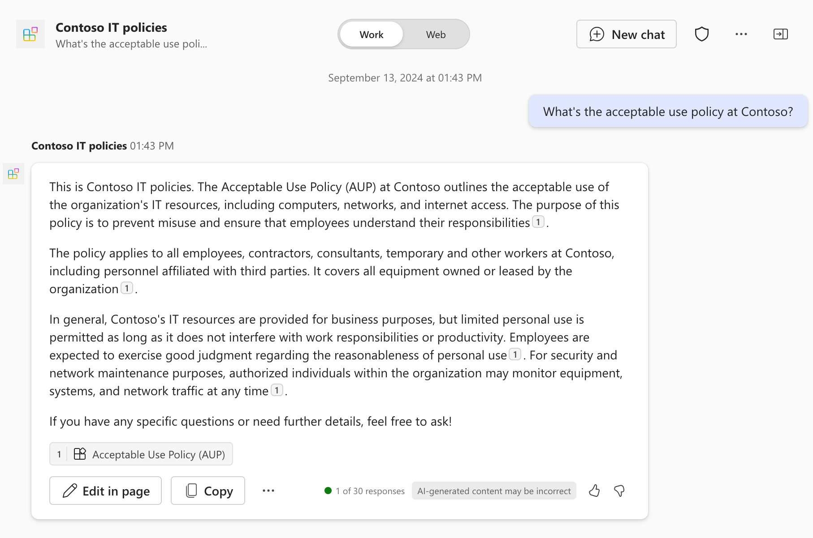

---
lab:
  title: '演習 3: テストとデバッグ'
  module: 'LAB 04: Add custom knowledge to declarative agents using Microsoft Graph connectors and Visual Studio Code'
---

# 演習 3: テストとデバッグ

この演習では、宣言型エージェントをテストして Microsoft 365 に展開し、Microsoft 365 Copilot Chat を使用してテストします。

### 演習の期間

- **推定所要時間**: 5 分

## タスク 1 - Microsoft 365 Copilot で宣言型エージェントをテストする

宣言型エージェントをテストするには、アプリとして Microsoft 365 テナントにデプロイします。 Microsoft 365 Copilot で開いた後、意図したとおりに動作することを確認します。

Visual Studio Code:

1. **Activity Bar** (サイド バー) で、**[Teams Toolkit]** 拡張機能を開きます。
1. **Lifecycle** ペインで、**[Provision]** を選択します。 Teams Toolkit は、宣言型エージェント プロジェクトをアプリとしてパッケージ化し、Microsoft 365 にアップロードします。
1. Web ブラウザーを開きます。

Web ブラウザーで以下を行います。

1. [https://www.microsoft365.com/chat](https://www.microsoft365.com/chat) に移動します。
1. Microsoft 365 テナントに所属する職場アカウントでサインインします。
1. Microsoft 365 Copilot のサイド パネルで、 **[Contoso IT Policies]** エージェントを選択してアクティブ化します。
1. チャット テキスト ボックスで、 `What's the acceptable use policy at Contoso?` に質問します。
1. エージェントが応答するまで待ちます。 Graph コネクタが取り込んだ外部コンテンツへの参照が応答にどのように含まれているかを確認します。 各参照の URL は、コンテンツが格納されている外部システム内の場所を指します。

    