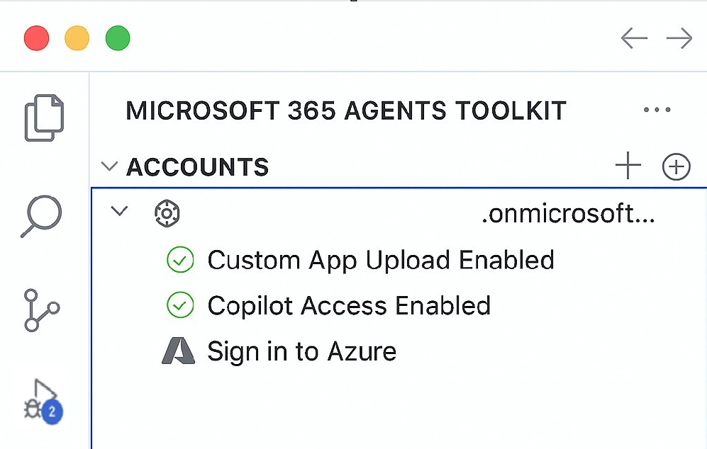
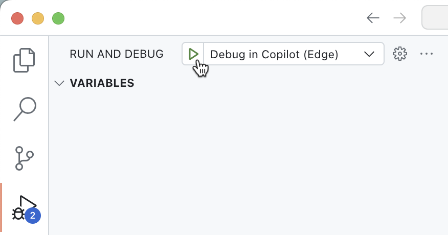
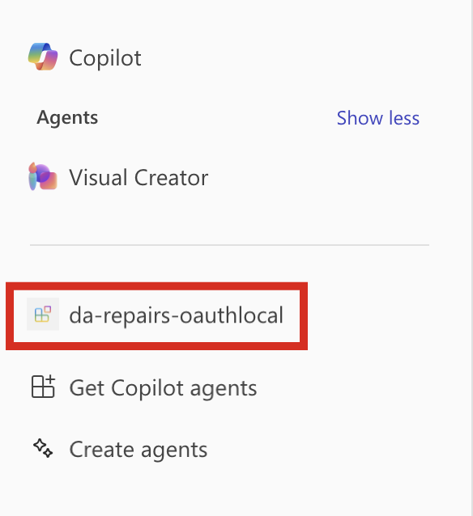
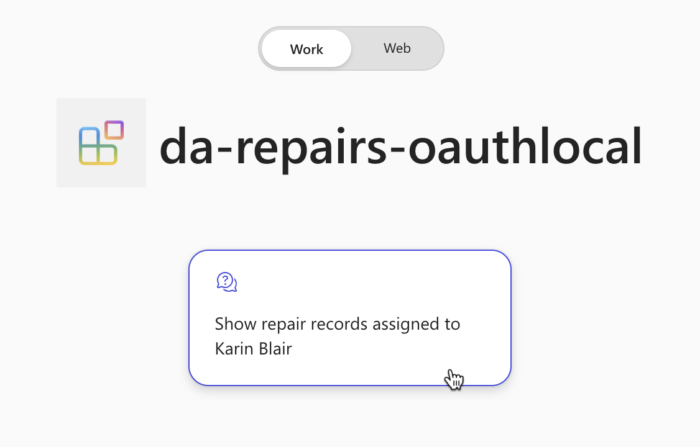
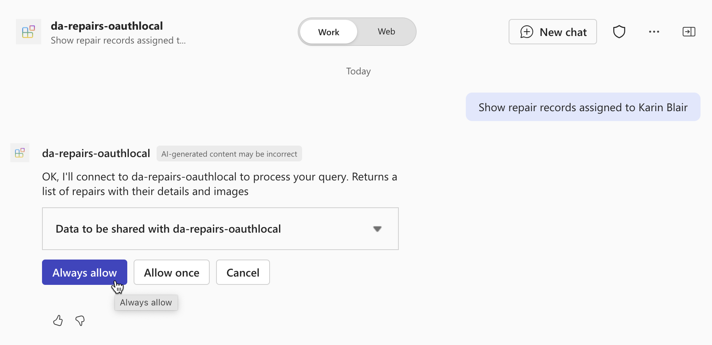
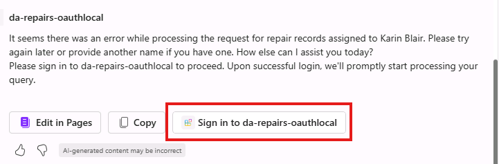
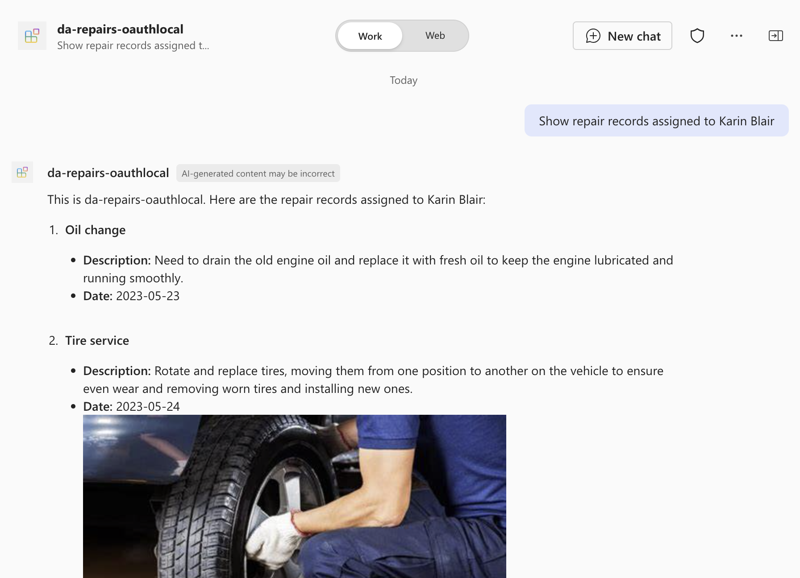
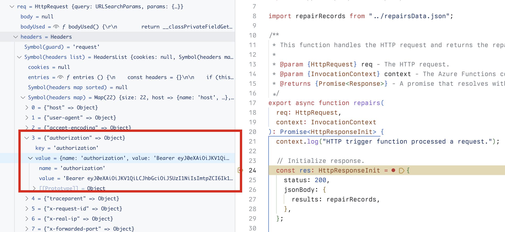

---
lab:
  title: '演習 4: Microsoft 365 Copilot Chat で宣言型エージェントをテストする'
  module: 'LAB 05: Authenticate your API plugin for declarative agents with secured APIs'
  description: この演習では、宣言型エージェントをテストして Microsoft 365 に展開し、Microsoft 365 Copilot Chat を使用してテストします。
  duration: 5 minutes
  level: 300
  islab: true
  primarytopics:
    - Microsoft 365
    - Microsoft 365 Copilot
    - Microsoft 365 Copilot Chat
---

# 演習 4: Microsoft 365 Copilot で宣言型エージェントをテストする

この演習では、宣言型エージェントをテストして Microsoft 365 に展開し、Microsoft 365 Copilot Chat を使用してテストします。

> [!NOTE]
> 続ける前に、現在のスキーマに合わせて **manifest.json** を更新します。
> - **.env.local** ファイルの **TEAMS_APP_ID** から正しい値を使用して、`manifest.json` の **`id`** を更新します。
> - **`short`** 名を `da-repairs-oauth${APP_NAME_SUFFIX}` から **`da-repairs-oauth`** に更新します。
> - **`copilotExtensions`** の名前を **`copilotAgents`** に変更します。
> - **`declarativeCopilots`** の名前を **`declarativeAgents`** に変更します。

### 演習の期間

- **推定所要時間**: 5 分

## タスク 1: Microsoft 365 Copilot の API プラグインを使用して宣言型エージェントをテストする

最後の手順では、Microsoft 365 Copilot の API プラグインを使用して宣言型エージェントをテストします。

Visual Studio Code:

1. アクティビティ バーで、**[Microsoft 365 エージェント ツールキット]** 拡張機能をアクティブ化します。
1. **[Microsoft 365 エージェント ツールキット]** 拡張機能パネルの **[Accounts]** セクションで、Microsoft 365 テナントにサインインしていることを確認します。

    

1. Activity Barで、**[Run and Debug]** ビューに切り替えます。
1. 構成の一覧から、**[Debug Copilot (Edge)]** を選択し、再生ボタンを押してデバッグを開始します。

    

    Visual Studio Code によって、Microsoft 365 Copilot で新しい Web ブラウザーが開きます。 メッセージが表示されたら、Microsoft 365 アカウントでサインインします。

Web ブラウザーで以下を行います。

1. サイド パネルで、**[da-repairs-oauthlocal]** エージェントを選択します。

    

1. プロンプト テキスト ボックスに `Show repair records assigned to Karin Blair` を入力し、プロンプトを送信します。

    > [!TIP]
    > プロンプトを入力する代わりに、会話スターターから選択できます。

    

1. **[Always allow]** ボタンを使用して、API プラグインにデータを送信することを確認します。

    

1. メッセージが表示されたら、**[Sign in to da-repairs-oauthlocal]** を選択し、API にサインインして、Microsoft 365 テナントへのサインインに使用するアカウントと同じアカウントを引き続き使用します。

    

1. エージェントが応答するまで待ちます。

    

API はローカル コンピューター上で実行されているため、匿名でアクセスできますが、Microsoft 365 Copilot は API 仕様で指定されているように認証された API を呼び出しています。要求にアクセス トークンが含まれていることを確認するには、**repairs** 関数にブレークポイントを設定し、宣言型エージェントで別のプロンプトを送信します。 コードがブレークポイントに到達したら、req.headers コレクションを展開し、JSON Web Token (JWT) を含む Authorization ヘッダーを探します。

テストが完了したら、Visual Studio Code でデバッグ セッションを停止します。
